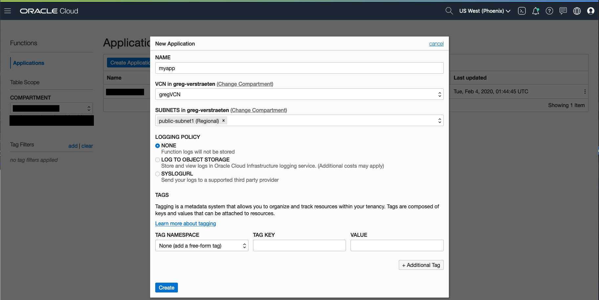

# Function Hello World

This function returns the "Hello World" message or "Hello <name>" when you provide a name in the function call payload.

As you make your way through this tutorial, look out for this icon .
Whenever you see it, it's time for you to perform an action.


## Pre-requisites
1. Start by making sure all of your policies are correct from this [guide](https://docs.cloud.oracle.com/iaas/Content/Functions/Tasks/functionscreatingpolicies.htm?tocpath=Services%7CFunctions%7CPreparing%20for%20Oracle%20Functions%7CConfiguring%20Your%20Tenancy%20for%20Function%20Development%7C_____4)

2. Have [Fn CLI setup with Oracle Functions](https://docs.cloud.oracle.com/iaas/Content/Functions/Tasks/functionsconfiguringclient.htm?tocpath=Services%7CFunctions%7CPreparing%20for%20Oracle%20Functions%7CConfiguring%20Your%20Client%20Environment%20for%20Function%20Development%7C_____0)


## Create an Application to run your function
You can use an application already created or create a new one using either the CLI or the OCI console.


### using the CLI
```
fn create app <app-name> --annotation oracle.com/oci/subnetIds='["<subnet-ocid>"]'
```
Get the OCID of the subnet in your VCN you wish to use.

e.g.
```
fn create app myapp --annotation oracle.com/oci/subnetIds='["ocid1.subnet.oc1.phx.aaaaaaaacnh..."]'
```

### using the OCI console
Log in to the [OCI console](https://console.us-phoenix-1.oraclecloud.com/) with your account, select the same region and compartment you specified when you configured the Fn CLI context.

On the OCI console, navigate to Developer Services > Functions. Click `Create Application` and specify:
- The name for the new application as *myapp*.
- The VCN and subnet in which to run the function.

Click `Create`.




## Writing the code of function

The [Python folder](./python) contains the files to deploy the HelloWorld function in Python:
* the code of the function, [func.py](./python/func.py)
* its dependencies, [requirements.txt](./python/requirements.txt)
* the function metadata, [func.yaml](./python/func.yaml)

The [Java folder](./java) contains the files to deploy the HelloWorld function in Java:
* the code of the function, [src/main/java/com/example/fn/HelloFunction.java](./java/src/main/java/com/example/fn/HelloFunction.java)
* its dependencies, [pom.xml](./java/pom.xml)
* the function metadata, [func.yaml](./java/func.yaml)


You can also generation your own HelloWorld function files by running the following command from your terminal:

```
fn init --runtime <runtime-language> helloworld
```

where <runtime-language> is one of the supported runtime languages (currently go, java, node, and python are supported).

For example:
```
fn init --runtime python helloworld
```

A directory called *helloworld* is created containing the necessary files to deploy the HelloWorld function.


## Deploy the function


Change directory to the *helloworld* directory created in the previous step:

```
cd helloworld
```

If you did not generate your own function and you are deploying what is provided in this repo, change to either `Java` or  `Python`.

To deploy the function, run the following command:
```
fn -v deploy --app <your app name>
```
e.g.
```
fn -v deploy --app myapp
```


## Invoke the function


Invoke the *helloworld* function by entering:

```
fn invoke <your app name> helloworld
```
e.g. 
```
fn invoke myapp helloworld
```

The Python version displays `{"message":"Hello World!"}` and the Java version displays `Hello World!`

You can also pass in a payload to invoke the function. 
For Java, run:
```
echo -n "Bob" | fn invoke <your app name> helloworld
```
The `Hello Bob!` output is displayed.
For Python, run:
```
echo -n '{"name":"Bob"}' | fn invoke <your app name> helloworld
```
The `{"message":"Hello Bob!"}` output is displayed.

Congratulations! You've just created, deployed, and invoked the HelloWorld function using Oracle Functions!