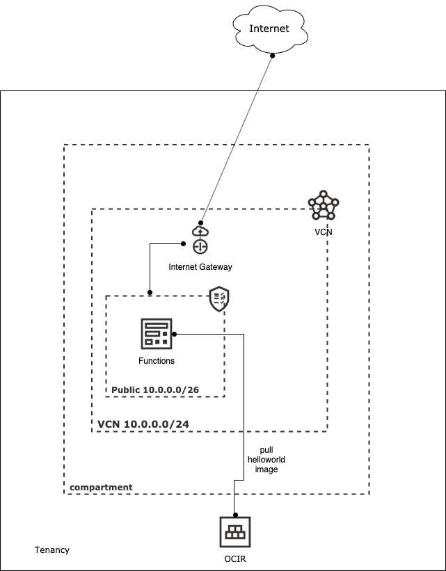

# OCI Functions Terraform QuickStart Example

This is a OCI (Oracle Cloud Infrastructure) Functions Hello World terraform automation. It creates all the necessary OCI resources (VCN, Subnets etc..) required including OCI functions application and function and finally invokes it. All this is done using terraform.

In this example we will create:
* 1 x VCN
* 1 x Subnet (Public)
* 1 x Internet Gateway for Public Subnet
* 1 x OCI function

As you make your way through this tutorial, look out for this icon .
Whenever you see it, it's time for you to perform an action.

## Prerequisites

Before you deploy this sample function, make sure you have run step C of the [Oracle Functions Quick Start Guide for Cloud Shell](https://www.oracle.com/webfolder/technetwork/tutorials/infographics/oci_functions_cloudshell_quickview/functions_quickview_top/functions_quickview/index.html)

    C - Set up your Cloud Shell dev environment

Note: Alternatively, You can also use your local machine or OCI Compute as your dev environments. refer the quick start guide.

## Architecture



## Create Docker image using cloudshell 

*  Login to OCI Cloud Console and Launch cloud shell


*  Use the context for your region, Here ap-sydney-1 is used as an example 
```
fn list context
fn use context ap-sydney-1
```


*  Update the context with the function's compartment ID 
```
fn update context oracle.compartment-id ocid1.compartment.oc1..
```


*  Update the context with the location of the Registry you want to use 
```
fn update context registry syd.ocir.io/<YOUR-NAMESPACE>/[YOUR-OCIR-REPO]
```

*  [Generate Auth Token](https://docs.cloud.oracle.com/en-us/iaas/Content/Registry/Tasks/registrygettingauthtoken.htm)


*  Log into the Registry using the Auth Token as your password, [reference](https://docs.cloud.oracle.com/en-us/iaas/Content/Functions/Tasks/functionslogintoocir.htm)


```
docker login -u '<YOUR-NAMESPACE>/oracleidentitycloudservice/<User-EMAIL-ID>' syd.ocir.io
```
  


#  Create Docker image


*  Generate a 'hello-world' boilerplate function 
```
fn init --runtime python helloworld
```


*  Create Docker image 
```
cd helloworld
```

*  Create a file named Dockerfile and add the below contents 
```
FROM oraclelinux:7-slim
WORKDIR /function
RUN groupadd --gid 1000 fn && adduser --uid 1000 --gid fn fn

RUN  yum-config-manager --disable ol7_developer_EPEL && \
     yum-config-manager --enable ol7_optional_latest && \
     yum -y install python3 oracle-release-el7 && \
     rm -rf /var/cache/yum

ADD . /function/
RUN pip3 install --no-cache --no-cache-dir -r requirements.txt
RUN rm -fr /function/.pip_cache ~/.cache/pip requirements.txt func.yaml Dockerfile README.md

ENV PYTHONPATH=/python
ENTRYPOINT ["/usr/local/bin/fdk", "/function/func.py", "handler"]
```


*  Build and Push to OCI Registry 
```
docker build . -t syd.ocir.io/ociateam/helloworld:0.0.1
docker push syd.ocir.io/ociateam/helloworld:0.0.1
```


## Terraform
Prepare one variable file named `terraform.tfvars` with the required information 
The contents of `terraform.tfvars` should look something like the following:


```
tenancy_id = "ocid1.tenancy.oc1..xxxxxxxxxxxxxxxxxxxxxxxxxxxxxxxxxxxxxxxxxxxxxxxxxxxxxxxxxxxx"
user_id = "ocid1.user.oc1..xxxxxxxxxxxxxxxxxxxxxxxxxxxxxxxxxxxxxxxxxxxxxxxxxxxxxxxxxxxx"
fingerprint= "xx:xx:xx:xx:xx:xx:xx:xx:xx:xx:xx:xx:xx:xx:xx:xx"
private_key_path = "~/.oci/oci_api_key.pem"
region = "ap-sydney-1"
default_compartment_id = "ocid1.compartment.oc1..xxxxxxxxxxxxxxxxxxxxxxxxxxxxxxxxxxxxxxxxxxxxxxxxxxxxxxxxxxxx"
```

Then apply the example using the following commands:


```
$ terraform init
$ terraform plan
$ terraform apply
```

## Output

```
Outputs:

function_result = {
  "base64_encode_content" = false
  "content" = "{\"message\": \"Hello Oracle\"}"
  "fn_invoke_type" = "sync"
  "function_id" = "ocid1.fnfunc.oc1.ap-sydney-1.aaaaaaaaaa"
  "id" = "2020-07-05 23:28:22.737902 +0000 UTC"
  "invoke_endpoint" = "https://xxxx.ap-sydney-1.functions.oci.oraclecloud.com"
  "invoke_function_body" = "{\"name\":\"Oracle\"}"
}
```

## Known Issues

Occasionally you might encounter this error while function invoke, if it happens wait for few seconds and 
re-run $ terraform apply.
```
oci_functions_invoke_function.this: Creating...

Error: Service error:NotAuthenticated. Not authenticated. http status code: 401. Opc request id: cd21e84b557068d812ad3660fd66022e/01ECGMWPC01BT0M70ZJ000Y9ZP/01ECGMWPC01BT0M70ZJ000Y9ZQ

  on functions.tf line 41, in resource "oci_functions_invoke_function" "this":
  41: resource "oci_functions_invoke_function" "this" {
```