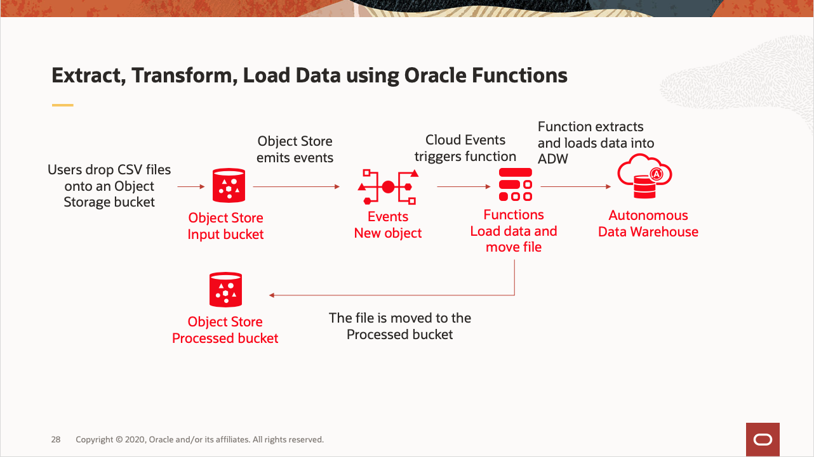

# Automatically load data from Object Storage into Autonomous Data Warehouse
We often have to extract data from various databases or applications and load it into a Data Warehouse to get analysed. 
You can automate this process on OCI using Cloud Storage, Cloud Events, Functions and Autonomous Data Warehouse.



This tutorial describes the implementation of this use case.

A demo of the implementation of this use case is available at:
https://otube.oracle.com/media/Automatically+load+data+from+Object+Storage+into+ADW/0_yje0dojq

As you make your way through this tutorial, look out for this icon .
Whenever you see it, it's time for you to perform an action.


## Prerequisites
Before you deploy this sample function, make sure you have run step A, B and C of the [Oracle Functions Quick Start Guide for Cloud Shell](https://www.oracle.com/webfolder/technetwork/tutorials/infographics/oci_faas_gettingstarted_quickview/functions_quickview_top/functions_quickview/index.html)
* A - Set up your tenancy
* B - Create application
* C - Set up your Cloud Shell dev environment


## Create or Update your Dynamic Group
In order to use other OCI Services, your function must be part of a dynamic group. For information on how to create a dynamic group, refer to the [documentation](https://docs.cloud.oracle.com/iaas/Content/Identity/Tasks/managingdynamicgroups.htm#To).

When specifying the *Matching Rules*, we suggest matching all functions in a compartment with:
```
ALL {resource.type = 'fnfunc', resource.compartment.id = 'ocid1.compartment.oc1..aaaaaxxxxx'}
```
Please check the [documentation](https://docs.cloud.oracle.com/iaas/Content/Identity/Tasks/managingdynamicgroups.htm#To) for other *Matching Rules* options.


## Create Object Storage buckets
You need two buckets in Object Storage. The first bucket is the location where you will drop the CSV files to be imported into Autonomous Datawarehouse. The files will be moved to the second bucket once they are processed. 


Create the two buckets, for example "input-bucket" and "processed-bucket". Check the *Emit Object Events* box for the first bucket (for input).


## Create or Update IAM Policies
Create a new policy that allows the dynamic group to manage objects in your two buckets.


Your policy should look something like this:
```
Allow dynamic-group <your dynamic group name> to manage objects in compartment <your compartment name> where target.bucket.name=<bucket name>
```
e.g.
```
Allow dynamic-group dg-greg to manage objects in compartment <my-compartment> where target.bucket.name='input-bucket'
Allow dynamic-group dg-greg to manage objects in compartment <my-compartment> where target.bucket.name='processed-bucket'
```

For more information on how to create policies, check the [documentation](https://docs.cloud.oracle.com/iaas/Content/Identity/Concepts/policysyntax.htm).


## Create an Autonomous Data Warehouse
The function accesses Autonomous Database using SODA (Simple Oracle Document Access) for simplicity. Other type of access can be used by modifying the function.

Use an existing Autonomous DataWarehouse or create a new one as follows.


On the OCI console, navigate to *Autonomous Data Warehouse* and click *Create Autonomous Database*. In the Create Autonomous Database dialog, enter the following:
- Display Name
- Compartment
- Database Name
- Infrastructure Type: Shared
- Admin password
- License type


For more information, go to https://docs.cloud.oracle.com/iaas/Content/Database/Tasks/adbcreating.htm

On the Autonomous Database detail page, click *Service Console*


On the Service Console, navigate to Development and copy the ORDS Base URL, we will need it in the next sections.


The *admin* schema is enabled for REST access by default, so you can test the function using the *admin* schema. For Production, it is recommended to create a separate schema and enable REST Service. For more information on how to do this, check the documentation at https://docs.oracle.com/en/database/oracle/oracle-rest-data-services/19.1/index.html.


From your terminal, create the collection 'regionsnumbers':
```bash
export ORDS_BASE_URL=<your ADW ORDS URL>
curl -X PUT -u 'ADMIN:<DB password>' -H "Content-Type: application/json" $ORDS_BASE_URL/admin/soda/latest/regionsnumbers
```

List collections:
```bash
curl -u 'ADMIN:<DB password>' -H "Content-Type: application/json" $ORDS_BASE_URL/admin/soda/latest/
```

Once data is inserted, query all documents in the collection 'regionsnumbers' with:
```bash
curl -X POST -u 'ADMIN:<DB password>' -H "Content-Type: application/json" --data '{}' $ORDS_BASE_URL/admin/soda/latest/regionsnumbers?action=query
```

To empty the collection 'regionsnumbers':
```bash
curl -X POST -u 'ADMIN:<DB password>' -H "Content-Type: application/json" $ORDS_BASE_URL/admin/soda/latest/regionsnumbers?action=truncate 
```


## Review and customize your function
Review the following files in the current folder:
* the code of the function, [func.py](./func.py)
* its dependencies, [requirements.txt](./requirements.txt)
* the function metadata, [func.yaml](./func.yaml)


## Deploy the function
In Cloud Shell, run the *fn deploy* command to build the function and its dependencies as a Docker image, 
push the image to the specified Docker registry, and deploy the function to Oracle Functions 
in your application that you created earlier:


```
fn -v deploy --app <your app name>
```


## Set the function configuration values
The function requires several configuration variables to be set.


Use the *fn* CLI to set the config value:
```
fn config function <your app name> <function name> ords-base-url <ORDS Base URL>
fn config function <your app name> <function name> db-schema <DB schema>
fn config function <your app name> <function name> db-user <DB user name>
fn config function <your app name> <function name> dbpwd-cipher <DB encrypted password>
fn config function <your app name> <function name> input-bucket <input bucket name>
fn config function <your app name> <function name> processed-bucket <processed bucket name>
```
e.g.
```
fn config function myapp oci-adb-ords-runsql-python ords-base-url "https://xxxxxx-db123456.adb.us-region.oraclecloudapps.com/ords/"
fn config function myapp oci-adb-ords-runsql-python db-schema "admin"
fn config function myapp oci-adb-ords-runsql-python db-user "admin"
fn config function myapp oci-adb-ords-runsql-python dbpwd-cypher "xxxxxxxxx"
fn config function myapp oci-adb-ords-runsql-python input-bucket "input-bucket"
fn config function myapp oci-adb-ords-runsql-python processed-bucket "processed-bucket"
```


## Create a Cloud Event rule


Create a Cloud Event rule on the console navigating to Application Integration > Event Service. Click *Create Rule*.


Assign a display name and a description.
In the *Rule Conditions* section,create 3 conditions:
* type = *Event Type*, Service Name = *Object Storage*, Event Type = *Object - Create*
* type = *Attribute*, Attribute Name = *compartmentName*, Attribute Value = *your compartment name*
* type = *Attribute*, Attribute Name = *bucketName*, Attribute Value = *your input bucket*
In the *Actions* section, set the *Action type* as "Functions", select your *Function Compartment*, your *Function Application*, and your *Function ID*.


## Test
In order to test the workflow, proceed as follows:


Upload one or all CSV files from the current folder to your *input bucket*. Let's imagine those files contains sales data from different regions of the world.

On the OCI console, navigate to *Autonomous Data Warehouse* and click on your database, click on *Service Console*, navigate to Development, and click on *SQL Developer Web*. Authenticate with your ADMIN username and password.
Enter the following query in the *worksheet* of *SQL Developer Web*:
```sql
select UTL_RAW.CAST_TO_VARCHAR2( DBMS_LOB.SUBSTR( JSON_DOCUMENT, 4000, 1 )) AS json from regionsnumbers
```
You should see the data from the CSV files.
