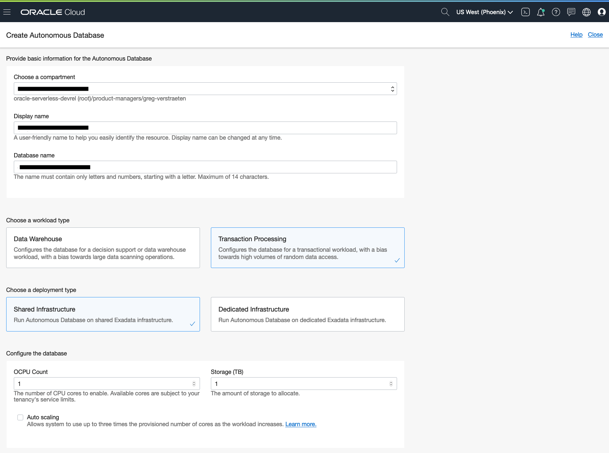

# Execute a SQL statement against Autonomous Database using the Oracle client
This function connects to Oracle Autonomous Database (either Transaction Processing or Data Warehouse) using the Oracle Client and execute a SQL statement. 

As you make your way through this tutorial, look out for this icon .
Whenever you see it, it's time for you to perform an action.


## Prerequisites
Before you deploy this sample function, make sure you have run step A, B and C of the [Oracle Functions Quick Start Guide for Cloud Shell](https://www.oracle.com/webfolder/technetwork/tutorials/infographics/oci_functions_cloudshell_quickview/functions_quickview_top/functions_quickview/index.html)
* A - Set up your tenancy
* B - Create application
* C - Set up your Cloud Shell dev environment


## List Applications 
Assuming your have successfully completed the prerequisites, you should see your 
application in the list of applications.
```
fn ls apps
```


## Create or Update your Dynamic Group
In order to use other OCI Services, your function must be part of a dynamic group. For information on how to create a dynamic group, refer to the [documentation](https://docs.cloud.oracle.com/iaas/Content/Identity/Tasks/managingdynamicgroups.htm#To).

When specifying the *Matching Rules*, we suggest matching all functions in a compartment with:
```
ALL {resource.type = 'fnfunc', resource.compartment.id = 'ocid1.compartment.oc1..aaaaaxxxxx'}
```
Please check the [Accessing Other Oracle Cloud Infrastructure Resources from Running Functions](https://docs.cloud.oracle.com/en-us/iaas/Content/Functions/Tasks/functionsaccessingociresources.htm) for other *Matching Rules* options.


## Review and customize the function
Review the following files in the current folder:
* the code of the function, [RunSQL.cs](./RunSQL.cs)
* its dependencies, [RunSQL.csproj](./RunSQL.csproj)
* the function metadata, [func.yaml](./func.yaml)


## Deploy the function
In Cloud Shell, run the *fn deploy* command to build the function and its dependencies as a Docker image, 
push the image to OCIR, and deploy the function to Oracle Functions in your application.


```
fn -v deploy --app <app-name>
```


## Create an Autonomous Database
Use an existing Autonomous Database (either Transaction Processing or Datawarehouse) or create a new one as follows.


On the OCI console, navigate to *Autonomous Transaction Processing* or *Autonomous Data Warehouse* and click *Create Autonomous Database*. In the Create Autonomous Database dialog, enter the following:
- Display Name
- Compartment
- Database Name
- Infrastructure Type: Shared
- Admin password
- License type


For more information, go to https://docs.cloud.oracle.com/iaas/Content/Database/Tasks/adbcreating.htm


## Database Wallet and IAM Policies
The Database wallet is not part of the Docker image because it is not secure. The function downloads the wallet directly from Autonomous Database while it is executed.


If you choose to retrieve the wallet from Autonomous Database directly during the execution of the function, note the OCID of the Autonomous Database and create an IAM policy that allows the dynamic group to use the autonomous Database with the specific permission 'AUTONOMOUS_DATABASE_CONTENT_READ'.
```
Allow dynamic-group <dynamic-group-name> to use autonomous-databases in compartment <compartment-name> where request.permission='AUTONOMOUS_DATABASE_CONTENT_READ'
```

For more information on how to create policies, check the [documentation](https://docs.cloud.oracle.com/iaas/Content/Identity/Concepts/policysyntax.htm).


## Set the function configuration values
The function requires several config value to be set.


Use the *fn CLI* to set the config value:
```
fn config function <app-name> <function-name> DBSVC <DB-service-name>
fn config function <app-name> <function-name> DBUSER <DB-username>
fn config function <app-name> <function-name> DBPWD_CYPHER <DB-encrypted-password>
```
Additionally, the DB wallet should be downloaded from the autonomous DB, specify the Autonomouns Database OCID:

```
fn config function <app-name> <function name> ADB_OCID <Autonomous-DB-OCID>
```
e.g. with a DB wallet in a bucket:
```
fn config function myapp oci-adb-client-runsql-dotnet DBSVC "gregadw_high"
fn config function myapp oci-adb-client-runsql-dotnet DBUSER "admin"
fn config function myapp oci-adb-client-runsql-dotnet DBPWD_CYPHER "dfgjksadhfg4526897dfgkj"
fn config function myapp oci-adb-client-runsql-dotnet ADB_OCID "db-wallets"

```


## Invoke the function

```

echo '{"sql":"<sql statement>"}' | fn invoke <app-name> oci-adb-client-runsql-dotnet
```
e.g.:
```
echo '{"sql":"select sysdate from dual"}' | fn invoke myapp oci-adb-client-runsql-dotnet
```

Upon success, the function returns a JSON object similar to this:
```
{
  "output": [
    {
      "sql": "select sysdate from dual",
      "result": [
        {
          "SYSDATE": "10/27/2022 03:02:38"
        }
      ]
    }
  ]
}
```


## Monitoring Functions

Learn how to configure basic observability for your function using metrics, alarms and email alerts:
* [Basic Guidance for Monitoring your Functions](../basic-observability/functions.md)

