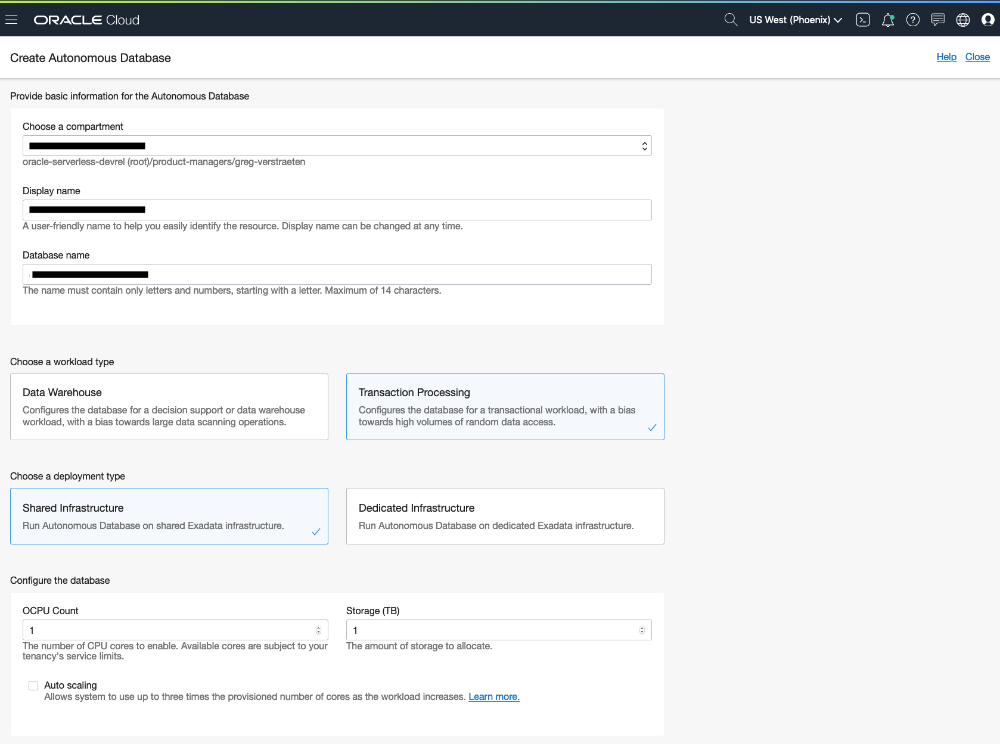
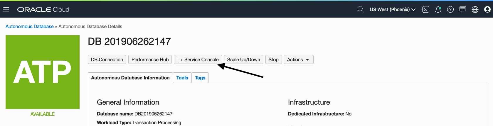
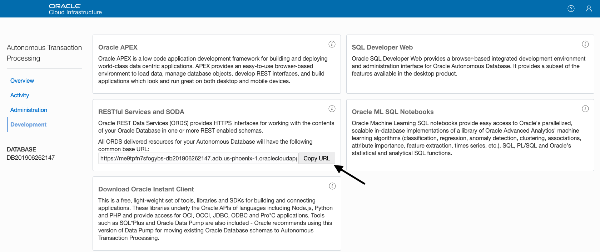

# Function that executes a SQL statement using ORDS

This function connects to an Autonomous Database using ORDS and executes a SQL statement.

As you make your way through this tutorial, look out for this icon .
Whenever you see it, it's time for you to perform an action.


## Prerequisites
Before you deploy this sample function, make sure you have run step A, B and C of the [Oracle Functions Quick Start Guide for Cloud Shell](https://www.oracle.com/webfolder/technetwork/tutorials/infographics/oci_functions_cloudshell_quickview/functions_quickview_top/functions_quickview/index.html)
* A - Set up your tenancy
* B - Create application
* C - Set up your Cloud Shell dev environment


## List Applications 
Assuming your have successfully completed the prerequisites, you should see your 
application in the list of applications.
```
fn ls apps
```


## Create or Update your Dynamic Group
In order to use other OCI Services, your function must be part of a dynamic group. For information on how to create a dynamic group, refer to the [documentation](https://docs.cloud.oracle.com/iaas/Content/Identity/Tasks/managingdynamicgroups.htm#To).

When specifying the *Matching Rules*, we suggest matching all functions in a compartment with:
```
ALL {resource.type = 'fnfunc', resource.compartment.id = 'ocid1.compartment.oc1..aaaaaxxxxx'}
```
Please check the [Accessing Other Oracle Cloud Infrastructure Resources from Running Functions](https://docs.cloud.oracle.com/en-us/iaas/Content/Functions/Tasks/functionsaccessingociresources.htm) for other *Matching Rules* options.


## Review and customize the function
Review the following files in the current folder:
* the code of the function, [RunSQL.cs](./RunSQL.cs)
* its dependencies, [RunSQL.csproj](./RunSQL.csproj)
* the function metadata, [func.yaml](./func.yaml)

In the code, we assume the schema and the database username are the same. Feel free to change this.


## Deploy the function
In Cloud Shell, run the *fn deploy* command to build the function and its dependencies as a Docker image, 
push the image to OCIR, and deploy the function to Oracle Functions in your application.


```
fn -v deploy --app <app-name>
```


## Create an Autonomous Database
Use an existing Autonomous Database (either Transaction Processing or Datawarehouse) or create a new one as follows.

On the OCI console, navigate to *Autonomous Transaction Processing* or *Autonomous Data Warehouse* and click *Create Autonomous Database*. In the Create Autonomous Database dialog, enter the following:
- Display Name
- Compartment
- Database Name
- Infrastructure Type: Shared
- Admin password
- License type


For more information, go to https://docs.cloud.oracle.com/iaas/Content/Database/Tasks/adbcreating.htm

On the Autonomous Database detail page, click *Service Console*


On the Service Console, navigate to Development and copy the ORDS Base URL, we will need it in the next section.


The *admin* schema is enabled for REST access by default, so you can test the function using the *admin* schema. For Production, it is recommended to create a separate schema and enable REST Service. For more information on how to do this, check the documentation at https://docs.oracle.com/en/database/oracle/oracle-rest-data-services/19.1/index.html.


## Set the function configuration values
The function requires the config value *ords-base-url*, *db-schema* and *db-pwd-cypher* to be set.


Use the *fn CLI* to set the config value:
```
fn config function <app-name> <function-name> ords_base_url <ORDS-Base-URL>
fn config function <app-name> <function-name> db_schema <DB-schema>
fn config function <app-name> <function-name> db_pwd_cypher <DB-encrypted-password>
```
e.g.
```
fn config function myapp oci-adb-ords-runsql-dotnet ords_base_urll "https://xxxxxx-db123456.adb.us-region.oraclecloudapps.com/ords/"
fn config function myapp oci-adb-ords-runsql-dotnet db_schema "admin"
fn config function myapp oci-adb-ords-runsql-dotnet db_pwd_cypher "xxxxxxxxx"
```


## Invoke the function

```

echo '{"sql":"<sql statement>"}' | fn invoke <app-name> oci-adb-ords-runsql-dotnet
```
e.g.:
```
echo '{"sql":"select sysdate from dual"}' | fn invoke myapp oci-adb-ords-runsql-dotnet
```

Upon success, the function returns a JSON object similar to this:
```json
{"output":[{"sql":"select sysdate from dual","result":[{"sysdate":"10/20/2022 00:29:35"}],"error":[]}]}
```
Here is another example with the table EMP created in the ADMIN schema. Ref. https://docs.oracle.com/en/database/oracle/oracle-rest-data-services/19.4/qsord/get-started-with-oracle-rest-data-services.html#GUID-14BE2F08-842E-4D2F-86B9-EA245B8487F9.

```bash
echo '{"sql":"select * from emp"}' | fn invoke myapp oci-adb-ords-runsql-dotnet | jq .
```
```
{
  "output": [
    {
      "sql": "select * from emp",
      "result": [
        {
          "empno": "7369",
          "ename": "SMITH",
          "job": "CLERK",
          "mgr": "7902",
          "hiredate": "12/17/1980 00:00:00",
          "sal": "800",
          "comm": null,
          "deptno": "20"
        },
        {
          "empno": "7499",
          "ename": "ALLEN",
          "job": "SALESMAN",
          "mgr": "7698",
          "hiredate": "02/20/1981 00:00:00",
          "sal": "1600",
          "comm": "300",
          "deptno": "30"
        },
        {
          "empno": "7521",
          "ename": "WARD",
          "job": "SALESMAN",
          "mgr": "7698",
          "hiredate": "02/22/1981 00:00:00",
          "sal": "1250",
          "comm": "500",
          "deptno": "30"
        },
        {
          "empno": "7566",
          "ename": "JONES",
          "job": "MANAGER",
          "mgr": "7839",
          "hiredate": "04/02/1981 00:00:00",
          "sal": "2975",
          "comm": null,
          "deptno": "20"
        },
        {
          "empno": "7654",
          "ename": "MARTIN",
          "job": "SALESMAN",
          "mgr": "7698",
          "hiredate": "09/28/1981 00:00:00",
          "sal": "1250",
          "comm": "1400",
          "deptno": "30"
        },
        {
          "empno": "7698",
          "ename": "BLAKE",
          "job": "MANAGER",
          "mgr": "7839",
          "hiredate": "05/01/1981 00:00:00",
          "sal": "2850",
          "comm": null,
          "deptno": "30"
        },
        {
          "empno": "7782",
          "ename": "CLARK",
          "job": "MANAGER",
          "mgr": "7839",
          "hiredate": "06/09/1981 00:00:00",
          "sal": "2450",
          "comm": null,
          "deptno": "10"
        },
        {
          "empno": "7788",
          "ename": "SCOTT",
          "job": "ANALYST",
          "mgr": "7566",
          "hiredate": "04/19/1987 00:00:00",
          "sal": "3000",
          "comm": null,
          "deptno": "20"
        },
        {
          "empno": "7839",
          "ename": "KING",
          "job": "PRESIDENT",
          "mgr": null,
          "hiredate": "11/17/1981 00:00:00",
          "sal": "5000",
          "comm": null,
          "deptno": "10"
        },
        {
          "empno": "7844",
          "ename": "TURNER",
          "job": "SALESMAN",
          "mgr": "7698",
          "hiredate": "09/08/1981 00:00:00",
          "sal": "1500",
          "comm": "0",
          "deptno": "30"
        },
        {
          "empno": "7876",
          "ename": "ADAMS",
          "job": "CLERK",
          "mgr": "7788",
          "hiredate": "05/23/1987 00:00:00",
          "sal": "1100",
          "comm": null,
          "deptno": "20"
        },
        {
          "empno": "7900",
          "ename": "JAMES",
          "job": "CLERK",
          "mgr": "7698",
          "hiredate": "12/03/1981 00:00:00",
          "sal": "950",
          "comm": null,
          "deptno": "30"
        },
        {
          "empno": "7902",
          "ename": "FORD",
          "job": "ANALYST",
          "mgr": "7566",
          "hiredate": "12/03/1981 00:00:00",
          "sal": "3000",
          "comm": null,
          "deptno": "20"
        },
        {
          "empno": "7934",
          "ename": "MILLER",
          "job": "CLERK",
          "mgr": "7782",
          "hiredate": "01/23/1982 00:00:00",
          "sal": "1300",
          "comm": null,
          "deptno": "10"
        }
      ],
      "error": []
    }
  ]
}
```


## Monitoring Functions

Learn how to configure basic observability for your function using metrics, alarms and email alerts:
* [Basic Guidance for Monitoring your Functions](../basic-observability/functions.md)

