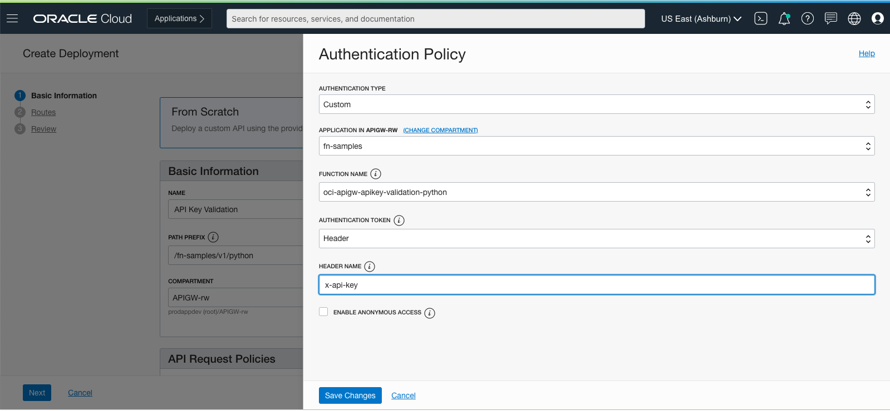
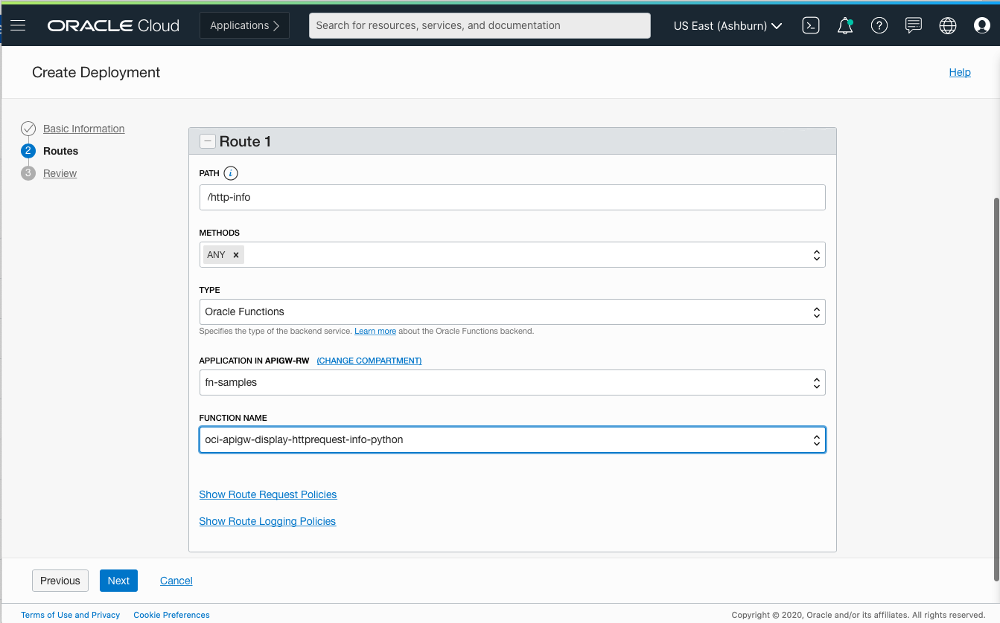
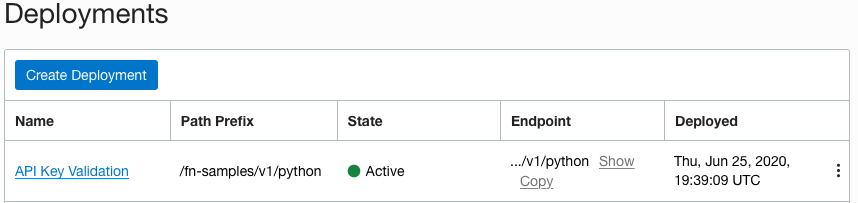

# Function that validates an API key
This is a sample function that can be used for a simple "API-Key" validation.  An API-Key is a simple method for securing an API by requiring the client to pass a specific token.  The gateway can use this as a custom authorizer to validate requests and only allow clients who pass the API-Key.

As you make your way through this tutorial, look out for this icon .
Whenever you see it, it's time for you to perform an action.


## Prerequisites
Before you deploy this sample function, make sure you have run step A, B and C of the [Oracle Functions Quick Start Guide for Cloud Shell](https://www.oracle.com/webfolder/technetwork/tutorials/infographics/oci_functions_cloudshell_quickview/functions_quickview_top/functions_quickview/index.html)
* A - Set up your tenancy
* B - Create application
* C - Set up your Cloud Shell dev environment
* D - Choose an back-end you would like to protect.  This can be any back-end you already have access to, or you can use the [Display HTTP Request sample](../oci-apigw-display-httprequest-info-python)


## List Applications 
Assuming your have successfully completed the prerequisites, you should see your 
application in the list of applications.
```
fn ls apps
```


## Review and customize the function
Review the following files in the current folder:
* the code of the function, [func.py](./func.py)
* its dependencies, [requirements.txt](./requirements.txt)
* the function metadata, [func.yaml](./func.yaml)


## Deploy the function
In Cloud Shell, run the *fn deploy* command to build the function and its dependencies as a Docker image, 
push the image to OCIR, and deploy the function to Oracle Functions in your application.


```
fn -v deploy --app <app-name>
```


## Set the function configuration values
The function requires the following configuration values to be set:
- FN_API_KEY


Use the *fn CLI* to set the config value:
```
fn config function <app-name> <function-name> FN_API_KEY <API key value>
```
e.g.
```
fn config function myapp oci-apigw-apikey-validation-python FN_API_KEY XXXXXXXXXXXX
```
Remember what you chose as you will need it later

## Create the API Gateway
The functions is meant to be invoked through API Gateway.


On the OCI console, navigate to *Developer Services* > *API Gateway*. Click on `Create Gateway`. Provide a name, set the type to "Public", select a compartment, a VCN, a public subnet, and click `Create`. 


Once created, click on your gateway. Under *Resources*, select *Deployments* and click `Create Deployment`.

  * Provide a name, a path prefix ("/fn-samples/v1/python" for example).
  * Add Authentication
    * Authentication Type: *Custom*
    * Choose the application and function you created for your API-Key validation function
    * Choose your Authentication token, you can use either Header or Query Parameter
    * Give a name to the token

Click *Save Changes* when you are finished


click `Next`. Provide a name to the route ("/http-info" for example), select methods "GET" and "POST", select your back-end of choice such as if you have the .



Click `Next` and finally, click `Save Changes`.

Note the endpoint of your API Gateway deployment.




## Create or Update your Dynamic Group for API Gateway
In order to invoke functions, your API Gateway must be part of a dynamic group.

When specifying the *Matching Rules*, we suggest matching all functions in a compartment with:
```
ALL {resource.type = 'ApiGateway', resource.compartment.id = 'ocid1.compartment.oc1..aaaaaxxxxx'}
```


## Create or Update IAM Policies for API Gateway
Create a new policy that allows the API Gateway dynamic group to invoke functions. We will grant `use` access to `functions-family` in the compartment.


Your policy should look something like this:
```
Allow dynamic-group <dynamic-group-name> to use functions-family in compartment <compartment-name>
```

For more information on how to create policies, check the [documentation](https://docs.cloud.oracle.com/iaas/Content/Identity/Concepts/policysyntax.htm).


## Invoke the function
The function returns the information of the HTTP request through API Gateway.


Set the Environment variable "APIGW_ENDPOINT" to the value of the endpoint of your API Gateway deployment, e.g.
```
export APIGW_ENDPOINT=https://xxxxx.apigateway.us-phoenix-1.oci.customer-oci.com/v1
```

Use the curl command to make the HTTP request and specify the API Key in your request:
```
curl -v -H "x-api-key:<value from FN_API_KEY>" $APIGW_ENDPOINT/http-info
```
You should receive the information from the HTTP request (or whatever back-end you chose)

Try sending a request with a non-matching key, or no key at all.

The gateway will reject the request with an HTTP401
