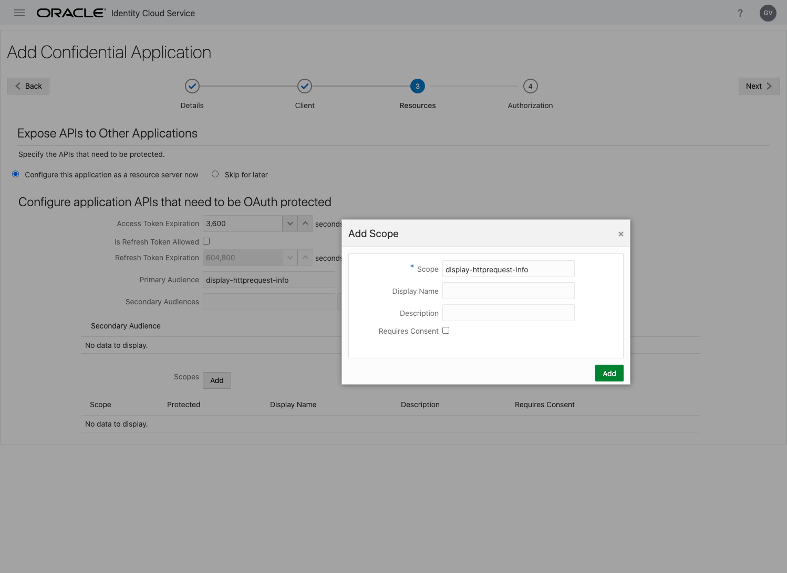
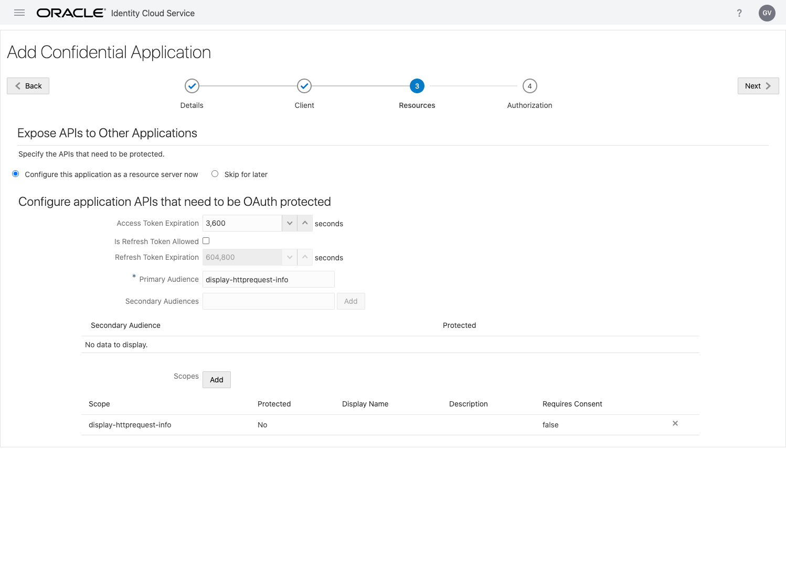
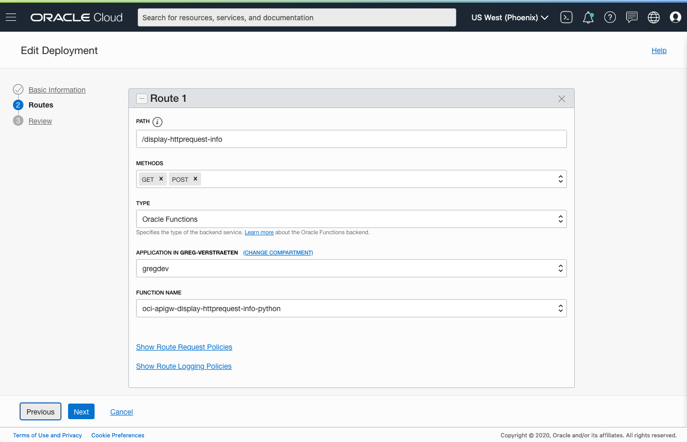
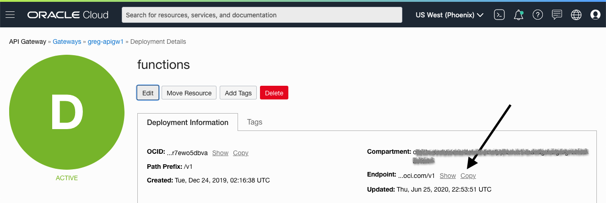

# API Gateway authorizer function for IDCS
This function provides authentication and authorization functionality for IDCS to an API gateway deployment. 
The implementation conforms to the guidelines in the OCI Documentation at https://docs.cloud.oracle.com/en-us/iaas/Content/APIGateway/Tasks/apigatewayusingauthorizerfunction.htm.

As you make your way through this tutorial, look out for this icon .
Whenever you see it, it's time for you to perform an action.


## Prerequisites
Before you deploy this sample function, make sure you have run step A, B and C of the [Oracle Functions Quick Start Guide for Cloud Shell](https://www.oracle.com/webfolder/technetwork/tutorials/infographics/oci_functions_cloudshell_quickview/functions_quickview_top/functions_quickview/index.html)
* A - Set up your tenancy
* B - Create application
* C - Set up your Cloud Shell dev environment
* D - Choose an back-end you would like to protect.  This can be any back-end you already have access to, or you can use the [Display HTTP Request sample](../oci-apigw-display-httprequest-info-python)


## List Applications 
Assuming your have successfully completed the prerequisites, you should see your 
application in the list of applications.
```
fn ls apps
```

## Deploy a function that implements an API
We need another function that will be a target for API Gateway. We suggest [oci-display-httprequest-info-python](../oci-display-httprequest-info-python).
In Cloud Shell, run the *fn deploy* command to build the function and its dependencies as a Docker image, 
push the image to OCIR, and deploy the function to Oracle Functions in your application.


```
cd ../oci-display-httprequest-info-python
fn -v deploy --app <app-name>
```

## Create or Update your Dynamic Group for API Gateway
In order to invoke functions, your API Gateway must be part of a dynamic group.

When specifying the *Matching Rules*, we suggest matching all functions in a compartment with:
```
ALL {resource.type = 'ApiGateway', resource.compartment.id = 'ocid1.compartment.oc1..aaaaaxxxxx'}
```


## Create or Update IAM Policies for API Gateway
Create a new policy that allows the API Gateway dynamic group to invoke functions. We will grant `use` access to `functions-family` in the compartment.


Your policy should look something like this:
```
Allow dynamic-group <dynamic-group-name> to use functions-family in compartment <compartment-name>
```

For more information on how to create policies, check the [documentation](https://docs.cloud.oracle.com/iaas/Content/Identity/Concepts/policysyntax.htm).


## Configure Identity Cloud Service (IDCS)
Login to IDCS admin console and create, add an Application and select "Confidential Application".

Enter a name for your IDCS Application, for example "myAPI".


For "Allowed Grant Types", select "Client Credentials" and "JWT Assertion". Click *Next*.


For Primary Audience, enter "display-httprequest-info" for example.
For Scopes, click *Add*. In the dialog box, for field "Scope", enter "display-httprequest-info", click *Add*.



Click *Next*.



Click *Finish*.


Now that the application is added, note the *Client ID* and *Client Secret*.


Click *Close*.

Click *Activate* and click *Ok* in the dialog.

Click *Generate Access Token* and click *Download Token* in the dialog. Open the downloaded file with a text editor and copy the value of the "app_access_token" without quotes. 

Note the *IDCS URL*, this is the URL you see in your browser URL bar, copy the scheme and host, do not include the path. For example: https://idcs-xxxxxxxxxxx.identity.oraclecloud.com/


## Review and customize the function
Review the following files in the current folder:
- [pom.xml](./pom.xml) specifies all the dependencies for your function
- [func.yaml](./func.yaml) that contains metadata about your function and declares properties
- [src/main/java/com/example/fn/AuthFunction.java](./src/main/java/com/example/fn/AuthFunction.java) which contains the Java code

The name of your function *oci-apigw-authorizer-idcs-java* is specified in [func.yaml](./func.yaml).

Rename [src/main/java/com/example/utils/ResourceServerConfig.java.template](./src/main/java/com/example/fn/AuthFunction.java) to *src/main/java/com/example/utils/ResourceServerConfig.java* and set the following variable to the values you noted while configuring IDCS.
```
public static final String CLIENT_ID = "xxxxxxxxxxx";
public static final String CLIENT_SECRET = "xxxxxxxxx";
public static final String IDCS_URL = "https://idcs-xxxxxxxx.identity.oraclecloud.com";

//INFORMATION ABOUT THE TARGET APPLICATION
public static final String SCOPE_AUD = "display-httprequest-info";
```


## Deploy the authorizer function
In Cloud Shell, run the *fn deploy* command to build the function and its dependencies as a Docker image, 
push the image to OCIR, and deploy the function to Oracle Functions in your application.


```
fn -v deploy --app <app-name>
```


## Create the API Gateway
The functions is meant to be invoked through API Gateway.


On the OCI console, navigate to *Developer Services* > *API Gateway*. Click on *Create Gateway*. Provide a name, set the type to "Public", select a compartment, a VCN, a public subnet, and click *Create*. 


Once created, click on your gateway. Under *Resources*, select *Deployments* and click *Create Deployment*.

  * Provide a name, a path prefix ("/v1" for example).
  * Add Authentication
    * Authentication Type: *Custom*
    * Choose the application and the authorizer function
    * For "Authentication token", select *Header*
    * For the "Header Name", enter "Autorization"

Click *Save Changes* when you are finished


Click *Next*. Provide a name to the route ("/display-httprequest-info" for example), select methods "GET" and "POST", select *Functions* for your back-end, and select your application and your function "oci-display-httprequest-info-python".



Click *Next* and finally, click *Save Changes*.

Note the endpoint of your API Gateway deployment.




## Invoke the function
The function returns the information of the HTTP request through API Gateway.


Set the Environment variable "APIGW_ENDPOINT" to the value of the endpoint of your API Gateway deployment, e.g.
```
export APIGW_ENDPOINT=https://xxxxx.apigateway.us-phoenix-1.oci.customer-oci.com/v1
```

Set the Environment variable "TOKEN" to the value of the token downloaded in IDCS, e.g.
```
export TOKEN=<long string of ASCII characters>
```

Use the curl command to make the HTTP request and specify the token in your request:
```
curl -v -H "Authorization: Bearer $TOKEN" $APIGW_ENDPOINT/display-httprequest-info
```
You should receive the information from the HTTP request (or whatever back-end you chose)

Try sending a request with a non-matching key, or no key at all.

The gateway will reject the request with an HTTP401.


## Monitoring Functions

Learn how to configure basic observability for your function using metrics, alarms and email alerts:
* [Basic Guidance for Monitoring your Functions](../basic-observability/functions.md)


