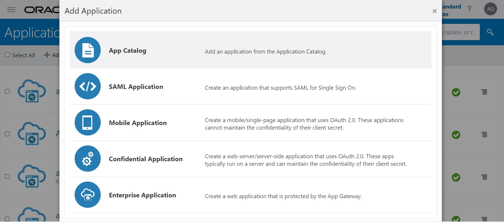
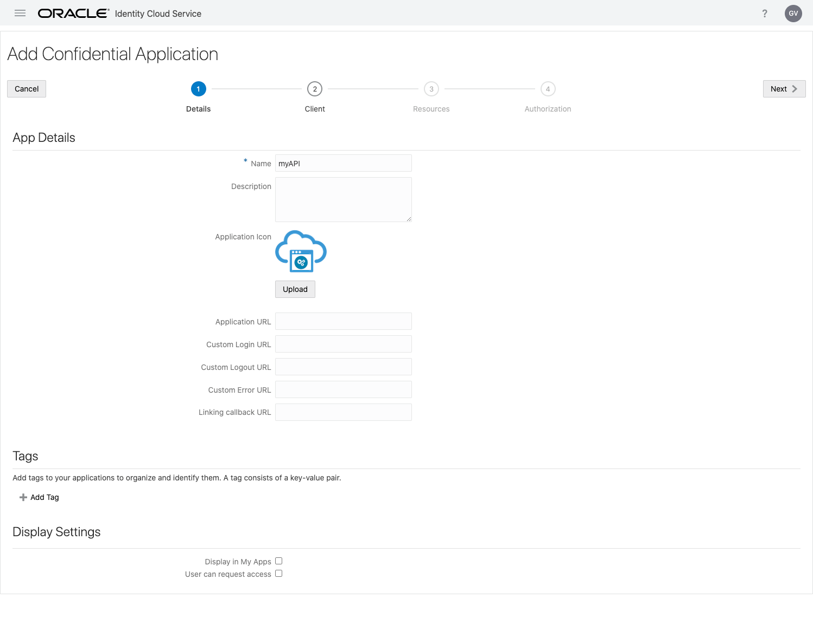
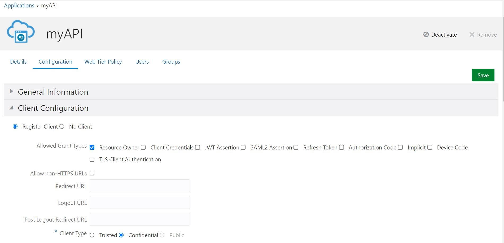
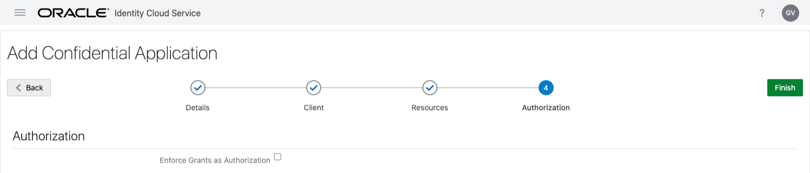
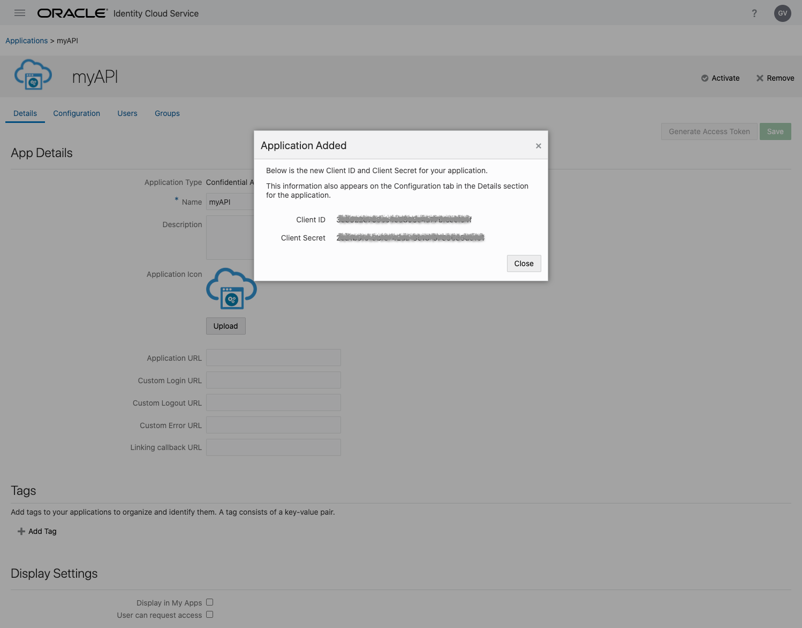
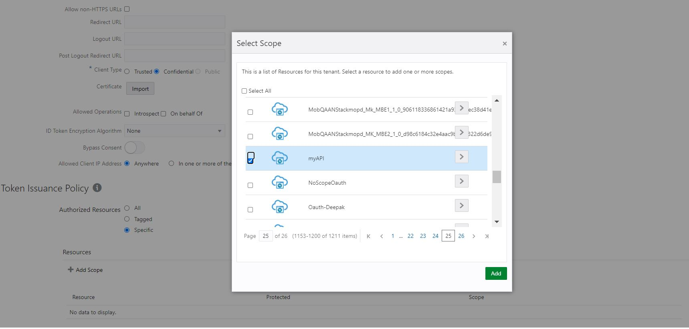
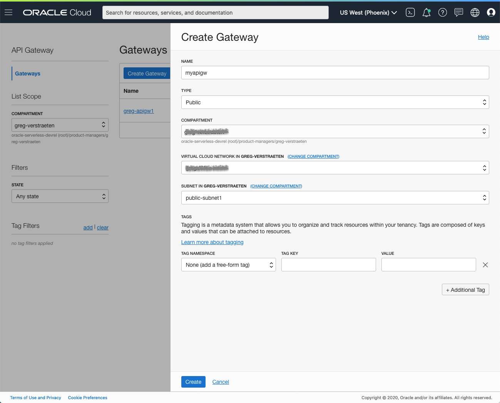
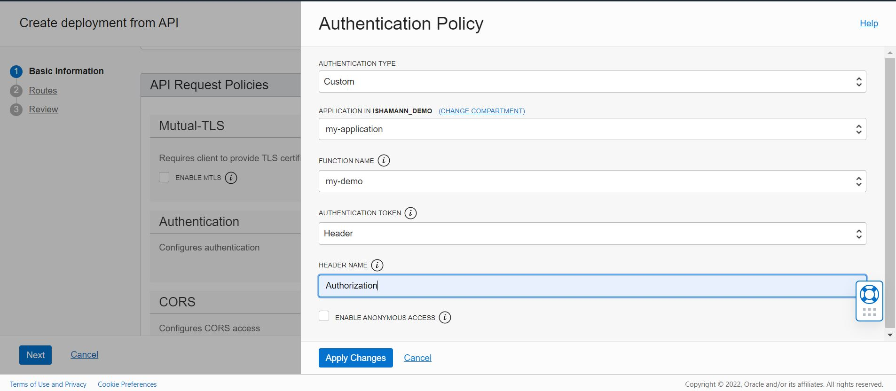
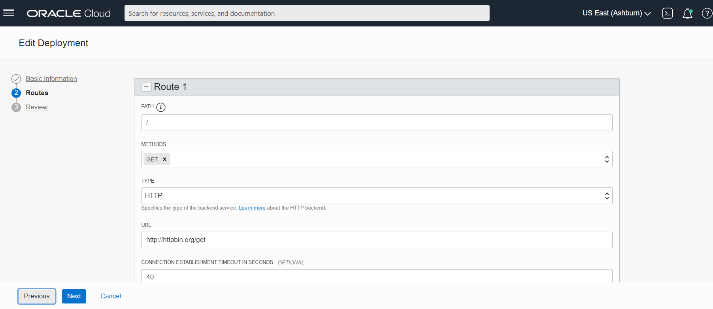
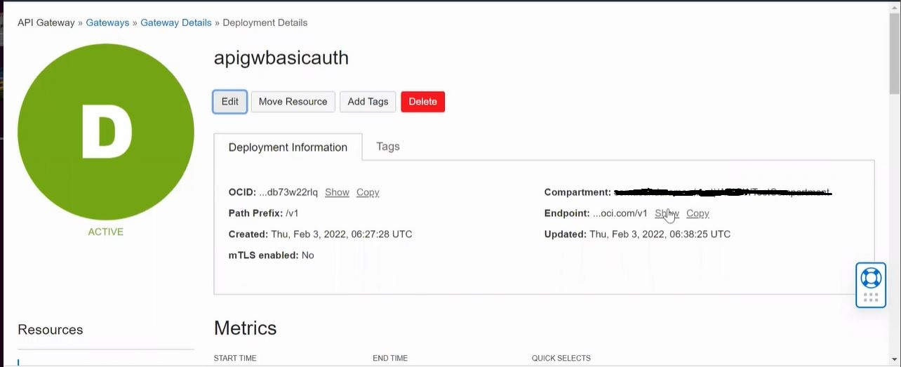

# API Gateway Basicauth function using Identity Cloud Service (IDCS)

This function provides verification of username and password against IDCS at runtime and allows only authorized users to access API gateway deployment.

The implementation conforms to the [documented guidlines for using authorizer functions to add Authentication and Authorization to API deployments](https://docs.cloud.oracle.com/en-us/iaas/Content/APIGateway/Tasks/apigatewayusingauthorizerfunction.htm).

As you make your way through this tutorial, look out for this icon .
Whenever you see it, it's time for you to perform an action.

## Prerequisites

[Create users in IDCS](https://docs.oracle.com/en/cloud/paas/identity-cloud/uaids/create-user-accounts.html)

Before you deploy this sample function, you need to complete steps A, B and C of the [Oracle Functions Quick Start Guide for Cloud Shell](https://www.oracle.com/webfolder/technetwork/tutorials/infographics/oci_functions_cloudshell_quickview/functions_quickview_top/functions_quickview/index.html)

- A - Set up your tenancy
- B - Create application
- C - Set up your Cloud Shell dev environment

## List Applications

Assuming your have successfully completed the prerequisites, you should see your
application in the list of applications.

```
fn ls apps
```

## Deploy a function that implements an API

We need another function that will be a target for API Gateway. We suggest [oci-display-httprequest-info-python](../oci-display-httprequest-info-python).
In Cloud Shell, run `fn deploy` to build the function and its dependencies as a container,
push the image to Oracle Cloud Infrastructure Registry (OCIR), and deploy the function to Oracle Functions in your application.


```
cd ../oci-display-httprequest-info-python
fn -v deploy --app <app-name>
```

## Create or Update your Dynamic Group for API Gateway

In order to invoke functions, your API Gateway must be part of a dynamic group.

When specifying the _Matching Rules_, we suggest matching all functions in a compartment with:

```
ALL {resource.type = 'ApiGateway', resource.compartment.id = 'ocid1.compartment.oc1..aaaaaxxxxx'}
```

## Create or Update IAM Policies for API Gateway

Create a new policy that allows the API Gateway dynamic group to invoke functions. We will grant `use` access to `functions-family` in the compartment.


Your policy should look something like this:

```
Allow dynamic-group <dynamic-group-name> to use functions-family in compartment <compartment-name>
```

For more information on how to create policies, check the [documentation](https://docs.cloud.oracle.com/iaas/Content/Identity/Concepts/policysyntax.htm).

## Configure Identity Cloud Service (IDCS)

Login to IDCS admin console and create, add an Application and select "Confidential Application".


Enter a name for your IDCS Application, for example "myAPI".



For "Allowed Grant Types", select "Resource Owner". Click _Next_.



For Primary Audience, enter anything "display-httprequest-info" for example.
For Scopes, click _Add_. In the dialog box, for field "Scope", enter anything "display-httprequest-info" for example, click _Add_.


Click _Next_.


Click _Finish_.



Now that the application is added, note the _Client ID_ and _Client Secret_.



Click _Close_.

Click on Configurations tab under Client Information section click on add scope and select the _application name_ from the dropdown. Note the scope value.




Click _Activate_ and click _Ok_ in the dialog.

Note the _IDCS URL_, this is the URL you see in your browser URL bar, copy the IDCS url ( For example: https://idcs-xxxxxxxxxxx.identity.oraclecloud.com/ ), client-id, client-secret and scope these values are provided to the Basicauth function.

## Review and customize the function

Review the following files in the current folder:

- [`pom.xml`](./pom.xml) specifies all the dependencies for your function
- [`func.yaml`](./func.yaml) that contains metadata about your function and declares properties
- [`src/main/java/com/example/fn/BasicAuth.java`](./src/main/java/com/example/fn/BasicAuth.java) which contains the Java code

The name of your function `basicauth` is specified in [`func.yaml`](./func.yaml).

set the following config variables to the values noted while configuring IDCS. The IDCS URL is the token endpoint that returns the access token after validating credentials

```
CLIENT_ID = "xxxxxxxxxxx";
CLIENT_SECRET = "xxxxxxxxx";
IDCS_URL = "https://idcs-xxxxxxxx.identity.oraclecloud.com/oauth2/v1/token";

//INFORMATION ABOUT THE TARGET APPLICATION
SCOPE_AUD = "display-httprequest-infodisplay-httprequest-info";
```

For the unit test to run, set the following variables in src/test/java/com/example/fn/BasicAuthTest.java

```java
    private static final String TEST_IDCS_URL = "https://idcs-xxxxxxxx.identity.oraclecloud.com/oauth2/v1/token";
    private static final String TEST_CLIENT_ID = "xxxxxxxxxxx";
    private static final String TEST_CLIENT_SECRET = "xxxxxxxxxxx";
    private static final String TEST_SCOPE_AUD = "display-httprequest-infodisplay-httprequest-info";
    private static final String TEST_TOKEN = "xxxxxxxxxxx";
```

## Deploy the basicauth function

In Cloud Shell, run `fn deploy` to build the function and its dependencies as a container,
push the image to OCIR, and deploy the function to Oracle Functions in your application.


```shell
fn -v deploy --app <app-name>
```

## Invoke the basicauth function in cloud shell

In Cloud Shell, run `fn invoke` to invoke the deployed function. It should return an active status of true if the token is valid or otherwise returns false.


```shell
echo -n '{"type":"TOKEN", "token":"Basic aW5jaGFyYS5zaGFtYW5uYUBvcmFj....."}' | fn invoke <app-name> <func-name>
```

## Create the API Gateway

The functions is meant to be invoked through API Gateway.


On the OCI console, navigate to _Developer Services_ > _API Gateway_. Click on _Create Gateway_. Provide a name, set the type to "Public", select a compartment, a VCN, a public subnet, and click _Create_.



Once created, click on your gateway. Under _Resources_, select _Deployments_ and click _Create Deployment_.

- Provide a name, a path prefix ("/basicauth" for example).
- Under _API Request Policies_ Add Authentication
  - Authentication Type: _Custom_
  - Choose the application and the basicauth function
  - For "Authentication token", select _Header_
  - For the "Header Name", enter "Autorization"

Click _Save Changes_ when you are finished


Click _Next_. Provide a name to the route ("/hello" for example), select methods eg: "GET", select _HTTP-URL_ for your back-end.



Click _Next_ and finally, click _Save Changes_.

Note the endpoint of your API Gateway deployment.



## Invoke the Deployment endpoint

The function validates if the user information is valid.


Use `curl` to make the HTTP request

```shell
 curl -i -u "<username>:<password>" https://d6xxxxxxxxk64.apigateway.us-ashburn-1.oci.customer-oci.com/basicauth/hello
```

If the user is valid gateway will make a call to backend with HTTP200 else
The gateway will reject the request with an HTTP401.
