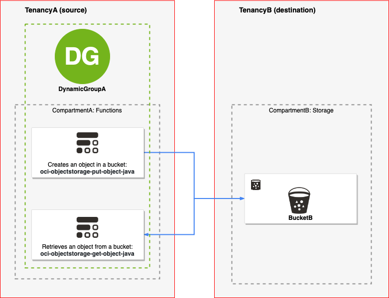
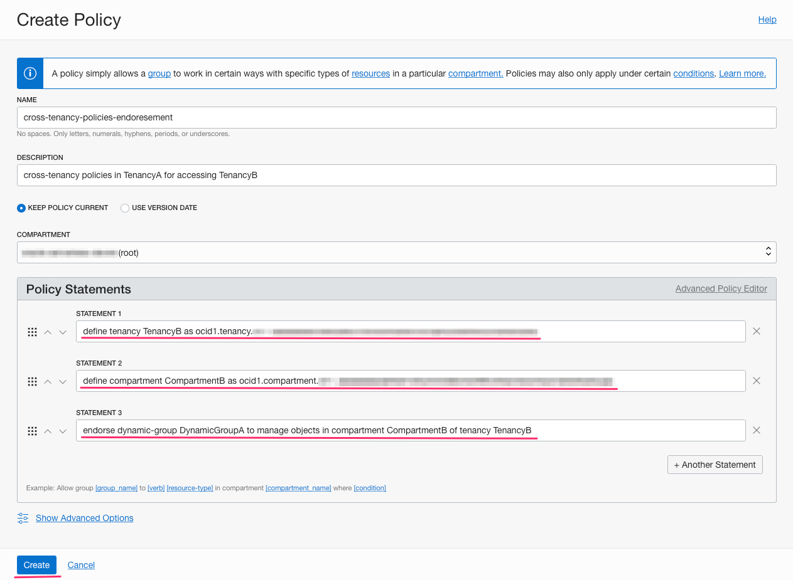
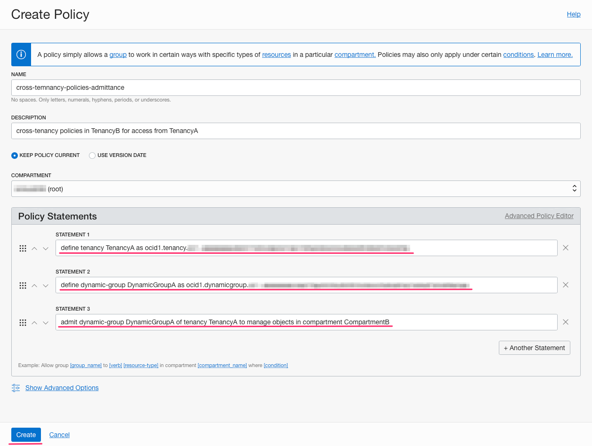

# Functions Cross-Tenancy Resources Access

Your organisation might also want to share resources with another organisation that has its own tenancy. It could be another business unit in your company, a customer of your company, a company that provides services to your company, and so on. In cases like these, you need cross-tenancy policies in addition to the required user and service policies described previously.

This tutorial shows how to write policies that enables Functions in your tenancy to access resources in other tenancies. We will deploy two functions, that creates an object in a bucket and retrieves an object from a bucket, in Object Storage in other tenancy. We will implement use case shown below on diagram, functions from TenancyA (source tenancy) will create and retrieve objects from Object Storage bucket BucketB in TenancyB (destination tenancy).

As you make your way through this tutorial, look out for this icon  . Whenever you see it, it's time for you to perform an action.

## Deploy functions

We will use functions from [Oracle Functions Samples repository](https://github.com/oracle/oracle-functions-samples) - this is GitHUb repository where we’ve published a collection of sample functions to show you how to use Functions to implement common serverless patterns and use cases. Among those samples, we will use two particular functions, [oci-objectstorage-put-object-java](https://github.com/oracle/oracle-functions-samples/tree/master/oci-objectstorage-put-object-java) to creatre objects and [oci-objectstorage-get-object-java](https://github.com/oracle/oracle-functions-samples/tree/master/oci-objectstorage-get-object-java) to retrieve objects.

~~~wiki
Please go ahead and deploy those two functions and test so you can confirm that they are working in TenancyA using BucketA.
Detailed steps are provided in our samples repository.
~~~

> Note: Here is the [Greg's blog](https://blogs.oracle.com/cloud-infrastructure/oracle-functions-announcing-samples-repository-and-quick-start-with-cloud-shell) if you want to check how to run examples using Cloud Shell.

In my case, the only configuration that I did was to setup proper value for config variable NAMESPACE:

~~~sh
fn config app demo-app NAMESPACE TenancyA
~~~

> When you create a bucket, the bucket is considered a private bucket and the access to the bucket and bucket contents requires authentication and authorisation, therefore you need policies to access it. However, Object Storage supports anonymous, unauthenticated access to a bucket. You make a bucket public by enabling read access to the bucket. This example works for private buckets.
> 
> ! Carefully assess the business requirement for public access to a bucket. When you enable anonymous access to a bucket, any user can obtain object metadata, download bucket objects, and optionally list bucket contents.

Let's test deployed functions in TenancyA that create and retrieve objects from BucketA in CompartmentA:

~~~sh
% echo -n '{"name": "file1.txt", "bucketName":"BucketA", "content": "This file was created in OCI object storage bucket using Oracle Functions"}' | fn invoke demo-app oci-objectstorage-put-object-java
Successfully submitted Put request for object file1.txt in bucket BucketA. OPC reuquest ID is <unique_ID>
~~~
~~~sh
% echo -n '{"name": "file1.txt", "bucketName":"BucketA"}' | fn invoke demo-app oci-objectstorage-get-object-java
This file was created in OCI object storage bucket using Oracle Functions
~~~

We can confirm that all works within TenancyA.

## Setup cross-tenancy policies

To access and share resources, the administrators of both tenancies need to create special policy statements that explicitly state the resources that can be accessed and shared. These special statements use the words: 

* Endorse - States the abilities that an any-user/group/dynamic group in source tenancy is authorised to access resources in a different tenancy. The Endorse statement belongs in the tenancy who is granting "endorsement" for the other tenancies. In the examples, we refer to this tenancy as the source - TenancyA.
* Admit -  The Admit statement identifies the any-user/group/dynamic group that requires resource access in some compartment in destination tenancy from the source tenancy and identified with a corresponding Endorse statement. The Admit statement belongs in the tenancy who is granting "admittance" to the tenancy.  In the examples, we refer to this tenancy as the destination - TenancyB.
* Define - Assigns an alias to a tenancy/compartment/group/dynamic group OCID for Endorse and Admit policy statements. It must be included in the same policy entity as the endorse or the admit statement.

So, for same tenancy calls, Allow statements are sufficient. For cross-tenancy calls, the destination tenancy has to Admit users/groups/dynamic groups from the source tenancy access to its resources, and the source tenancy has to Endorse its users/groups/dynamic groups as being capable of accessing resources in the destination tenancy.

### Prerequisites

#### TenancyA

If you followed steps for deploying functions that creates and retrieves objects then you will have Dynamic Group that includes all functions in compartment where you deployed it. When you setup cross-tenancy policies most likely you want to have better control, therefore we will create Dynamic Group that includes only those two functions.

Create Dynamic Group, in this tutorial we will use name `DynamicGroupA`, with specifying the Matching Rules:

~~~sh
ANY {resource.id = 'ocid1.fnfunc.function-put-object-ocid', resource.id = 'ocid1.fnfunc.oc1.iad.function-get-object-ocid'}
~~~

We have following resource from TenancyA that will be used in policies:

Resource  	 | OCID
------------- | -------------
TenancyA  	 | ocid1.tenancy.TenancyA-ocid
DynamicGroupA | ocid1.dynamicgroup.DynamicGroupA-ocid

#### TenancyB

We assume that there is BucketB in CompartmentB of TenancyB.

We have following resource from TenancyB that will be used in policies:

Resource  	 | OCID
------------- | -------------
TenancyB  	 | ocid1.tenancy.TenancyB-ocid
CompartmentB  | ocid1.compartment.CompartmentB-ocid

#### Cross-tenancy policies setup

Cross-tenancy policies - the use of ENDORSE and ADMIT statements - are restricted to root-level (tenancy, managed compartment) policies.

To remind ourselves, in order to authorise a cross-tenancy request, the request must be endorsed by the source's tenancy and admitted by the destination's tenancy.

##### Define policy in TenancyA:

define tenancy TenancyB as ocid1.tenancy.TenancyB-ocid

define compartment CompartmentB as ocid1.compartment.CompartmentB-ocid

endorse dynamic-group DynamicGroupA to manage objects in compartment CompartmentB of tenancy TenancyB

> Note: when creating policy you have to write both statements, define and endorse, before click on Create button when using OCI console.

##### Define policy in TenancyB:

define tenancy TenancyA as ocid1.tenancy.TenancyA-ocid

define dynamic-group DynamicGroupA as ocid1.dynamicgroup.DynamicGroupA-ocid

admit dynamic-group DynamicGroupA of tenancy TenancyA to manage objects in compartment CompartmentB

> Note: when creating policy you have to write both statements, define and admit, before click on Create button when using OCI console.

## Test the policies

 

Now we will update NAMESPACE variable to `TenancyB`

~~~sh
fn config app demo-app NAMESPACE TenancyB
~~~

 

First put object in BucketB:

~~~sh
% echo -n '{"name": "file1.txt", "bucketName":"BucketB", "content": "This file was created in OCI object storage BucketB using Oracle Functions in TenancyA"}' | fn invoke demo-app oci-objectstorage-put-object-java
Successfully submitted Put request for object file1.txt in bucket BucketB. OPC request ID is <unique_ID>
~~~

 

Retrieve object from BucketB:

~~~sh
% echo -n '{"name": "file1.txt", "bucketName":"BucketC"}' | fn invoke demo-app oci-objectstorage-get-object-java
This file was created in OCI object storage BucketB using Oracle Functions in TenancyA
~~~

That confirms that we can successfully create and retrieve object from another tenancy.

If you want further restrict access to just BucketB and not to whole CompartmentB than you can use `where` conditions in policies, for example you can add `where all {target.bucket.name = 'BucketB'}` to the `admin` statement in TenancyB. Than the whole statement would be:

~~~sh
admit dynamic-group DynamicGroupA of tenancy TenancyA to manage objects in CompartmentB where all {target.bucket.name='BucketB'}
~~~

The can be done on the source side too, even though, common practice I assume will be that the destination tenancy would like to have precise access control.