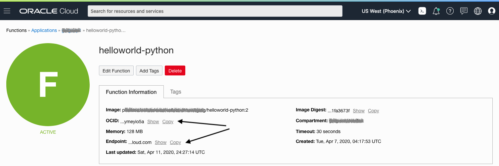

# Function that invoke another function using the OCI Dotnet SDK

This function invokes another function using the OCI Dotnet SDK and the Functions Resource Principal.

As you make your way through this tutorial, look out for this icon .
Whenever you see it, it's time for you to perform an action.


## Prerequisites
Before you deploy this sample function, make sure you have run step A, B and C of the [Oracle Functions Quick Start Guide for Cloud Shell](https://www.oracle.com/webfolder/technetwork/tutorials/infographics/oci_functions_cloudshell_quickview/functions_quickview_top/functions_quickview/index.html)
* A - Set up your tenancy
* B - Create application
* C - Set up your Cloud Shell dev environment


## List Applications 
Assuming your have successfully completed the prerequisites, you should see your 
application in the list of applications.
```
fn ls apps
```


## Create or Update your Dynamic Group
In order to use other OCI Services, your function must be part of a dynamic group. For information on how to create a dynamic group, refer to the [documentation](https://docs.cloud.oracle.com/iaas/Content/Identity/Tasks/managingdynamicgroups.htm#To).

When specifying the *Matching Rules*, we suggest matching all functions in a compartment with:
```
ALL {resource.type = 'fnfunc', resource.compartment.id = 'ocid1.compartment.oc1..aaaaaxxxxx'}
```
Please check the [Accessing Other Oracle Cloud Infrastructure Resources from Running Functions](https://docs.cloud.oracle.com/en-us/iaas/Content/Functions/Tasks/functionsaccessingociresources.htm) for other *Matching Rules* options.


## Create or Update IAM Policies
Now that your dynamic group is created, create a new policy that allows the
dynamic group to use any resources you are interested in receiving
information about, in this case we will grant access to `invoke functions` in
the functions related compartment.


Your policy should look something like this:
```
Allow dynamic-group <dynamic-group-name> to use fn-invocation in compartment <compartment-name>
```

For more information on how to create policies, check the [documentation](https://docs.cloud.oracle.com/iaas/Content/Identity/Concepts/policysyntax.htm).


## Review and customize the function
Review the following files in the current folder:
* the code of the function, [InvokeFn.cs](./InvokeFn.cs)
* its dependencies, [InvokeFn.csproj](./InvokeFn.csproj)
* the function metadata, [func.yaml](./func.yaml)


## Deploy the function
In Cloud Shell, run the *fn deploy* command to build the function and its dependencies as a Docker image, 
push the image to OCIR, and deploy the function to Oracle Functions in your application.


```
fn -v deploy --app <app-name>
```


## Invoke the function

The function requires the following keys in the payload when invoked:
- function_ocid, the OCID `ocid1.fnfunc.oc1.phx.aaaxxx` of the other function we are calling (HelloWorld for example) 
- function_endpoint, the endpoint `https://xxxxxx.ap-osaka-1.functions.oci.oraclecloud.com/xxxxx/actions/invoke` of the other function
- function_body, the body for the invocation of the other function

To test the function, we need another function to invoke. If you do not have any, create a 
HelloWorld function for example and get its OCID and endpoint and add it to the [test.json](./test.json) file.




```
fn invoke <app-name> oci-invoke-function-python < test.json
```
e.g.:
```
fn invoke myapp oci-invoke-function-python < test.json
```

Assuming the other function we are calling is a HelloWorld function, you should see the following output :
```json
{"message": "Hello World"}
```


## Monitoring Functions

Learn how to configure basic observability for your function using metrics, alarms and email alerts:
* [Basic Guidance for Monitoring your Functions](../basic-observability/functions.md)

