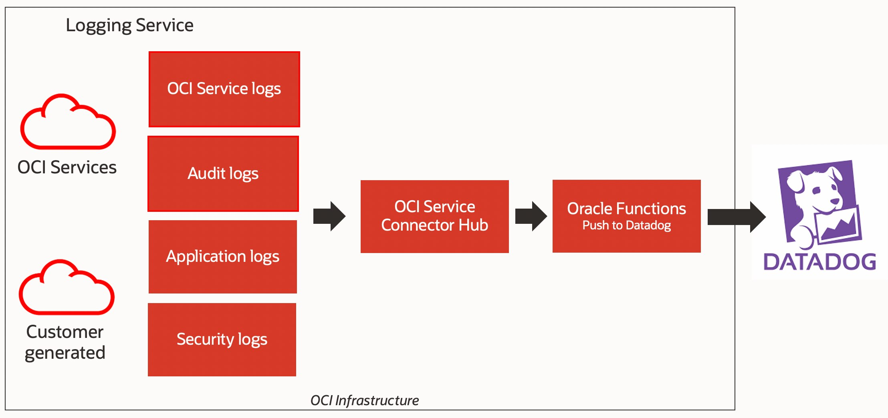

## Monitor Oracle Cloud Infrastructure with Datadog

Move logs from Oracle Cloud Infrastructure Logging service to Datadog for the following processes: Running analytics on service, audit, and custom logs in Datadog; Consolidating logs from multicloud and hybrid environments;




More
- [Detailed Steps](https://docs.oracle.com/en/learn/logs_oci_datadog/#introduction)


As you make your way through this tutorial, look out for this icon .
Whenever you see it, it's time for you to perform an action.


## Prerequisites

Before you deploy this sample function, make sure you have run steps A, B 
and C of the [Oracle Functions Quick Start Guide for Cloud Shell](https://www.oracle.com/webfolder/technetwork/tutorials/infographics/oci_functions_cloudshell_quickview/functions_quickview_top/functions_quickview/index.html)
* A - Set up your tenancy
* B - Create application
* C - Set up your Cloud Shell dev environment


## List Applications 

Assuming you have successfully completed the prerequisites, you should see your 
application in the list of applications.

```
fn ls apps
```


## Review and customize the function

Review the following files in the current folder:
* the code of the function, [func.py](./func.py)
* its dependencies, [requirements.txt](./requirements.txt)
* the function metadata, [func.yaml](./func.yaml)


## Create a Datadog API key

* In your Datadog account, select Integrations, and under the APIs, click create API key. This will generate your API key.
* Replace the value of the DATADOG_TOKEN in the [func.yaml](./func.yaml)


## Deploy the function

In Cloud Shell, run the `fn deploy` command to build *this* function and its dependencies as a Docker image, 
push the image to the specified Docker registry, and deploy *this* function to Oracle Functions 
in the application created earlier:


```
fn -v deploy --app <app-name>
```
e.g.,
```
fn -v deploy --app myapp
```


### Test

In Cloud Shell, run the following `fn invoke` command to unit test this function:


```
fn invoke <app-name> <function-name> < test-logs.json
```
e.g., 
```
fn invoke myapp oci-logs-to-datadog-python < test-logs.json
```

You should see the logs appear in Datadog.


## Configure the logs you want to capture

1. From the [OCI Console](https://cloud.oracle.com) navigation menu, select **Logging**, and then select **Log Groups**.

2. Click Create Log Group, select your compartment, add a Name and Description

3. Select Logs in the left menu, click Enable Service Log, select your compartment, select Log Category on Service and fill the rest of the fields appropriately.


## Create a Service Connector for reading logs from Logging and send to Functions

1. From the navigation menu, select **Logging**, and then select **Service Connectors**.

2. Click Create Connector, add a Name, Description, select the compartment, select the Source as **Logging** and Target as **Functions**.
    
3. On Configure Source connection, select the compartment, select the Log Group created earlier.

4. On Configure Target connection, select the compartment and select the Function. If prompted to create a policy for writing to functions, click Create.


## Monitoring Functions and Service Connector

Make sure you configure basic observability for your function and connector using metrics, alarms and email alerts:
* [Basic Guidance for Monitoring your Functions](../basic-observability/functions.md)
* [Basic Guidance for Monitoring your Service Connector](../basic-observability/service-connector-hub.md)

