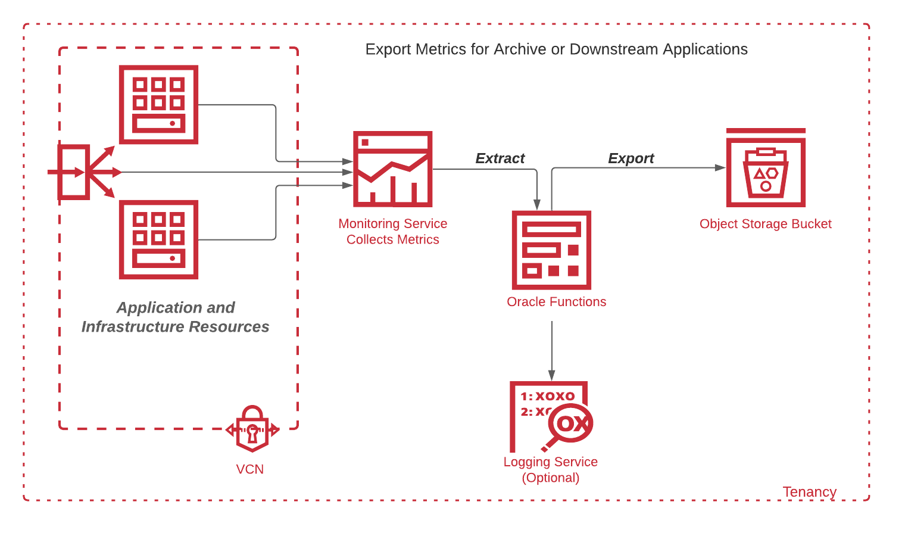

## Export Metrics to Object Storage

This sample Python function demonstrates how to submit a Monitoring Query Language (MQL) query to OCI Monitoring Service which will extract a collection of historical metrics and then push this package to Object Storage as a json file.  



This sample is intended to help you get up and running quickly by using default values for most parameters.  In fact, there is only one required parameter:  **compartmentId** --> this specifies the Object Storage Compartment to create the storage bucket (if it does not already exist).  Supply values for optional parameters to select target resources, specific metrics to collect, define time ranges, etc., per your requirements.  Advanced users may also replace the export function within the code to push metrics to your downstream application api.

The full list of *optional* parameters and their default values are presented below in the **Deploy** and **Test** sections.  But first let's cover Prerequisites and the Function Development Environment setup.


As you make your way through this tutorial, look out for this icon .
Whenever you see it, it's time for you to perform an action.


## Prerequisites

Before you deploy this sample function, make sure you have run steps A, B 
and C of the [Oracle Functions Quick Start Guide for Cloud Shell](https://www.oracle.com/webfolder/technetwork/tutorials/infographics/oci_functions_cloudshell_quickview/functions_quickview_top/functions_quickview/index.html)
* A - Set up your tenancy
* B - Create application
* C - Set up your Cloud Shell dev environment


## List Applications 

Assuming you have successfully completed the prerequisites, you should see your 
application in the list of applications.

```
fn ls apps
```


## Create or Update your Dynamic Group

In order to use other OCI Services, your function must be part of a dynamic 
group. For information on how to create a dynamic group, refer to the 
[documentation](https://docs.cloud.oracle.com/iaas/Content/Identity/Tasks/managingdynamicgroups.htm#To).

When specifying the *Matching Rules*, we suggest matching all functions in a compartment with:

```
ALL {resource.type = 'fnfunc', resource.compartment.id = 'ocid1.compartment.oc1..aaaaaxxxxx'}
```


## Create or Update IAM Policies

Create a new policy that allows the dynamic group to read metrics and manage object storage. 


Your policy should look something like this:
```
Allow dynamic group <group-name> to read metrics in compartment <compartment-name>
Allow dynamic group <group-name> to manage buckets in compartment <compartment-name>
Allow dynamic group <group-name> to manage objects in compartment <compartment-name>
```

For more information on how to create policies, go [here](https://docs.cloud.oracle.com/iaas/Content/Identity/Concepts/policysyntax.htm).


## Review and customize the function

Review the following files in the current folder:
* the code of the function, [func.py](./func.py)
* its dependencies, [requirements.txt](./requirements.txt)
* the function metadata, [func.yaml](./func.yaml)


## Deploy the function

In Cloud Shell, run the `fn deploy` command to build *this* function and its dependencies as a Docker image, 
push the image to the specified Docker registry, and deploy *this* function to Oracle Functions 
in the application created earlier:


```
fn -v deploy --app <app-name>
```
For example,
```
fn -v deploy --app myapp
```

### Test

You may test the function using default values by executing the following command, specifying the only mandatory parameter (compartmentId).  This will create an Object Storage bucket named metrics-export, if it does not already exist, and upload a json file containing per-minute avg cpu levels during the preceding hour for all VMs in the specified compartment.


```
echo '{"compartmentId":"<compartment-ocid>"}' | fn invoke <app-name> <function-name>
```
For example:
```
echo '{"compartmentId":"<your ocid1.compartment.oc1..aaaaxxxxxxx>"}' | fn invoke myapp oci-monitoring-metric-export-python
```

There are several optional parameters to customize the query and time range.  In addition to compartmentId, use any combination of additional parameters in the following format:

```
echo '{"compartmentId":"ocid1.compartment.oc1..aaaaxxxxxxx", "parameter_name_1":"<your parameter_value_1>", "parameter_name_2":"<your parameter_value_2>"}' | fn invoke myapp oci-monitoring-metric-export-python
```

For example, to select a specific namespace and custom query use this format:

```
echo '{"compartmentId":"ocid1.compartment.oc1..aaaaxxxxxxx", "namespace":"<your namespace>", "query":"<your query>"}' | fn invoke myapp oci-monitoring-metric-export-python
```

The following `parameters` are supported, along with default values if not specified.


**namespace**
* Description:    Category of metrics (see OCI Monitoring Documentation)
* Default: *oci_computeagent*

**resource_group**
* Description:    Subcategory of metrics (see OCI Monitoring Documentation)
* Default: *none*

**query**
* Description:    MQL query to filter metrics (see OCI Monitoring Documentation)
* Default: *CpuUtilization[1m].mean()*

**startdtm**
* Description:    Timestamp defining start of collection period
* Default: *1 hour prior to current time*

**enddtm**
* Description:    Timestamp defining end of collection period
* Default: *current time*

**resolution**
* Description:    Aggregation resolution (see OCI Monitoring Documentation)
* Default: *1m*


## Monitoring Functions
Learn how to configure basic observability for your function using metrics, alarms and email alerts:
* [Basic Guidance for Monitoring your Functions](../basic-observability/functions.md)
