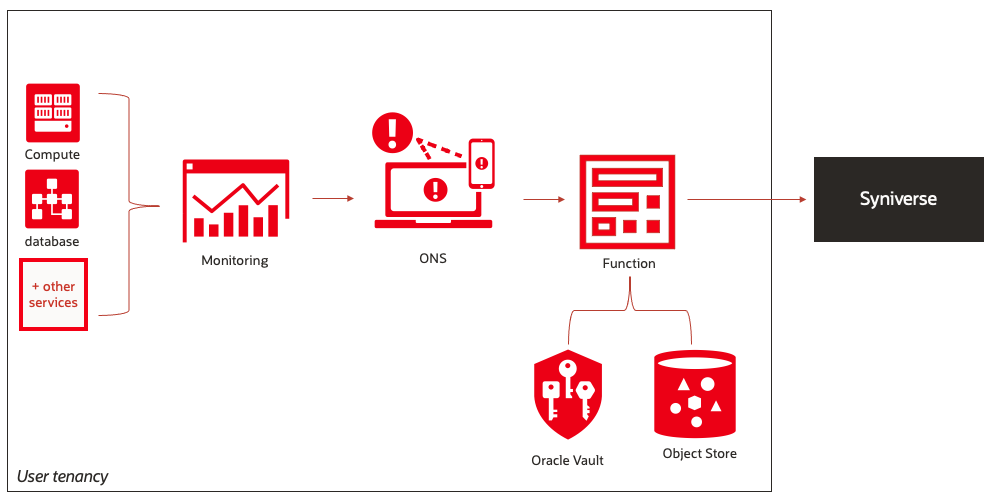
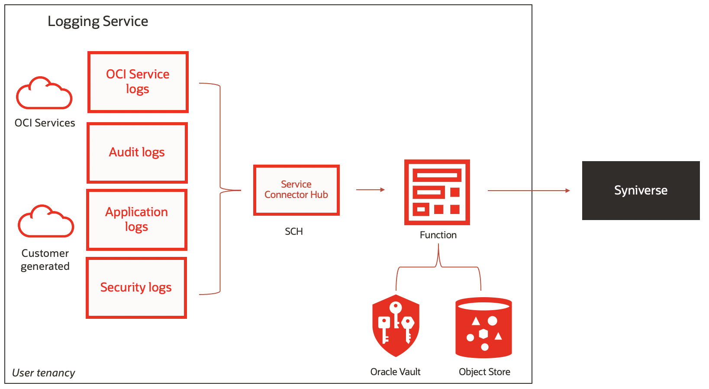

## Integrating OCI alerts and Logs with Syniverse SMS

This is an example to show how to send SMS from OCI using Notification Service, Function and [Syniverse](https://www.syniverse.com).
Syniverse offers support for an SMS service on a global scale that allows enterprise customers to send intelligent and customizable messages with a cloud-based solution.




Another option is to combine Logging and Service Connector Hub to emit a notification with the log content every time that a specific log is generated, such as every time a log has a 500 error.



More
- [Oracle Cloud Infrastructure (OCI) Account](https://www.oracle.com/cloud/free/)
- [Detailed Steps](https://docs.oracle.com/en/learn/events_syniverse/)
- [Syniverse Account](https://www.syniverse.com/)
- [Syniverse Quick Start](https://sdcsupport.syniverse.com/hc/en-us/articles/236185587-SCG-Quick-Start-guide)


As you make your way through this tutorial, look out for this icon .
Whenever you see it, it's time for you to perform an action.


## Prerequisites

Before you deploy this sample function, make sure you have run steps A, B 
and C of the [Oracle Functions Quick Start Guide for Cloud Shell](https://www.oracle.com/webfolder/technetwork/tutorials/infographics/oci_functions_cloudshell_quickview/functions_quickview_top/functions_quickview/index.html)
* A - Set up your tenancy
* B - Create application
* C - Set up your Cloud Shell dev environment


## List Applications 

Assuming you have successfully completed the prerequisites, you should see your 
application in the list of applications.

```
fn ls apps
```


## Create a Syniverse Account and API key

1. Go to the [Syniverse Developer Community](https://developer.syniverse.com/home.html) and create an account.

2. Sign in to your Syniverse account, go to the **Applications** menu, and click **Create New**.

3. Enter the following:
    * **Application Name**: oci
    * **Description**: Real-time SMS with OCI Alert or OCI logs
    * **Account**: Choose your initial account

4. After creating the application, click the application name and expand Auth Keys to see the API details. We use this info on the Oracle Function and Vaults.


## Create a Bucket and upload a file to Object Store

First, you need to create a Bucket.

1. From the menu in the upper-left corner, select **Core Infrastructure**, and then select **Object Storage**.

2. Select the compartment **syniverse_compartment** that you created.

3. Click **Create Bucket** and create a Bucket with **syniverse_phone_target_list** name

Create and upload a file with the phone number. The Function has an object store dependency because it reads the file with recipient phones to send the SMS.

1.  Create a local file called **numbers.txt** and add the phone number that you want to use for your case. The file should be comma delimited with no spaces.

2. From the Object Storage details screen click **Upload Objects** and select the **numbers.txt** file to upload


## Create an Oracle Vault

1. From the menu in the upper-left corner, select **Security**, and then select **Vault**.

2. Select **syniverse_compartment** that you created.

3. Click **Create Vault** and create a vault with **syniverse-api-credentials** name.

4. Choose your Vault, click **Create Key** and create a key with **syniverse-key** name,
leaving the other fields (protection mode, key shape algorithm, key shape length) as 
default.

5. Click on the **Secrets link** under **Resources** in the left navigation pane

6. Click **Create Secret** and use the following example:
    * **Name**: syniverse-token
    * **Encryption Key**: Select the **syniverse-key** that you created earlier
    * **Secret Type Template**: Base64 
    * **Secret Contents**: here you should add the **Access token** from Syniverse

7. Click on the secret **syniverse-token**, copy the secret **OCID** and replace the value in the 
func.yaml file of your sample function:
    * [alert-python](./alert-python/func.yaml)
    * [logs-python](./logs-python/func.yaml)


## Create or Update your Dynamic Group

In order to use other OCI Services, your function must be part of a dynamic 
group. For information on how to create a dynamic group, refer to the 
[documentation](https://docs.cloud.oracle.com/iaas/Content/Identity/Tasks/managingdynamicgroups.htm#To).

When specifying the *Matching Rules*, we suggest matching all functions in a compartment with:

```
ALL {resource.type = 'fnfunc', resource.compartment.id = 'ocid1.compartment.oc1..aaaaaxxxxx'}
```


## Create or Update IAM Policies

Create a new policy that allows the dynamic group to read objects and secret-bundles
in the functions-related compartment.


Your policy should look something like this:
```
Allow dynamic-group <dynamic-group-name> to read objects in compartment <compartment-name>
Allow dynamic-group <dynamic-group-name> to read secret-bundles in compartment <compartment-name>
```
e.g.
```
Allow dynamic-group demo-func-dyn-group to read objects in compartment demo-func-compartment
Allow dynamic-group demo-func-dyn-group to read secret-bundles in compartment demo-func-compartment
```

For more information on how to create policies, go [here](https://docs.cloud.oracle.com/iaas/Content/Identity/Concepts/policysyntax.htm).


## Review and customize the function

Refer to the readme for each function:

* [alert-python](./alert-python/README.md)
* [logs-python](./logs-python/README.md)


## Deploy the function

Refer to the readme for each function:

* [alert-python](./alert-python/README.md)
* [logs-python](./logs-python/README.md)


### Test

Refer to the readme for each function:

* [alert-python](./alert-python/README.md)
* [logs-python](./logs-python/README.md)

