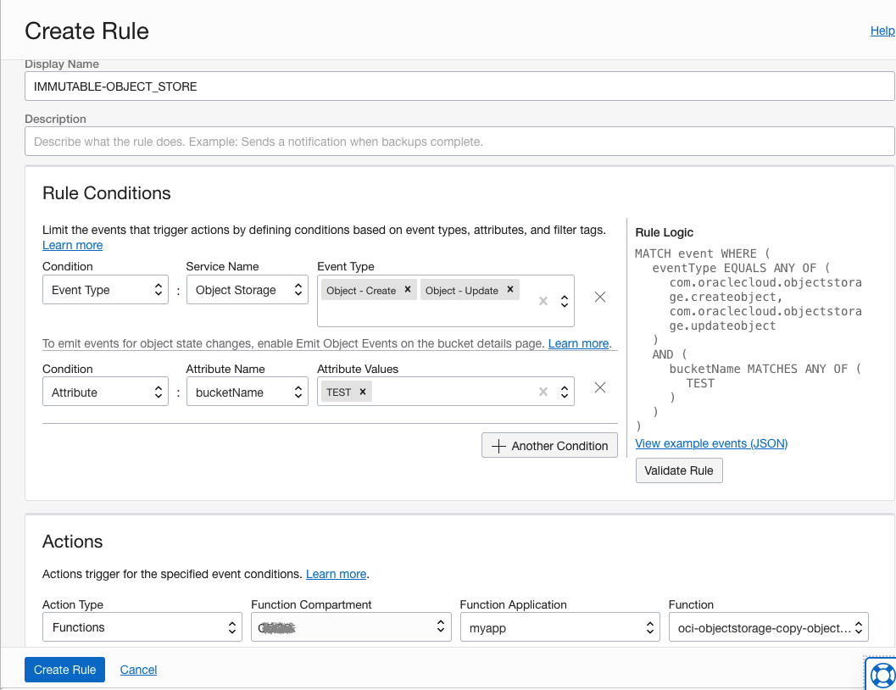

# Function that copies an object in an OCI Object Storage bucket to another bucket using the OCI Dotnet SDK
This function can be used to create *"Immutable Copies"* of objects in an OCI bucket by copying them, during creation/update, to another bucket with defined retention policies.  This is especially useful when using the [Oracle Backup Cloud Service](https://docs.oracle.com/en/cloud/paas/db-backup-cloud/csdbb/oracle-database-backup-cloud-service.html) to ensure backups are maintained for a specified amount of time.


This function uses Resource Principals to securely authorize a function to make
API calls to OCI services using the [OCI Dotnet SDK](https://docs.oracle.com/en-us/iaas/tools/dotnet/latest/api/index.html).
It creates an object in a bucket in Object Storage and returns a message with a status.


The function calls the following OCI Dotnet SDK classes:
* [Resource Principals](https://docs.oracle.com/en-us/iaas/tools/dotnet/latest/api/Oci.Common.Auth.ResourcePrincipalAuthenticationDetailsProvider.html) to authenticate
* [Object Storage Client](https://docs.oracle.com/en-us/iaas/tools/dotnet/latest/api/Oci.ObjectstorageService.ObjectStorageClient.html) to interact with Object Storage

As you make your way through this tutorial, look out for this icon .
Whenever you see it, it's time for you to perform an action.


## Prerequisites

1. Before you deploy this sample function, make sure you have run steps A, B 
and C of the [Oracle Functions Quick Start Guide for Cloud Shell](https://www.oracle.com/webfolder/technetwork/tutorials/infographics/oci_functions_cloudshell_quickview/functions_quickview_top/functions_quickview/index.html)
    * A - Set up your tenancy
    * B - Create application
    * C - Set up your Cloud Shell dev environment

2. Have your Oracle Object Storage Namespace available. This can be found by
logging into your [cloud account](https://console.us-ashburn-1.oraclecloud.com/),
under your user profile, click on your Tenancy. Your Object Storage Namespace
is shown there.


## List Applications 

Assuming you have successfully completed the prerequisites, you should see your 
application in the list of applications.

```
fn ls apps
```


## Create or Update your Dynamic Group

In order to use other OCI Services, your function must be part of a dynamic 
group. For information on how to create a dynamic group, refer to the 
[documentation](https://docs.cloud.oracle.com/iaas/Content/Identity/Tasks/managingdynamicgroups.htm#To).

When specifying the *Matching Rules*, we suggest matching all functions in a compartment with:

```
ALL {resource.type = 'fnfunc', resource.compartment.id = 'ocid1.compartment.oc1..aaaaaxxxxx'}
```


## Create or Update IAM Policies

Create a new policy that allows the dynamic group to `manage objects` and `manage buckets` in the functions related compartment.


Your policy should look something like this:
```
Allow service objectstorage-<region> to manage object-family in compartment <compartment-name>
Allow dynamic-group <dynamic-group-name> to manage objects in compartment <compartment-name>
Allow dynamic-group <dynamic-group-name> to manage buckets in compartment <compartment-name>
```
e.g.
```
Allow service objectstorage-eu-frankfurt-1 to manage object-family in compartment demo-func-compartment
Allow dynamic-group demo-func-dyn-group to manage objects in compartment demo-func-compartment
Allow dynamic-group demo-func-dyn-group to manage buckets in compartment demo-func-compartment
```
For more information on how to create policies, go [here](https://docs.cloud.oracle.com/iaas/Content/Identity/Concepts/policysyntax.htm).


## Review and customize the function

Review the following files in the current folder:

- [CopyObjects.csproj](./CopyObjects.csproj) specifies all the dependencies for your function
- [func.yaml](./func.yaml) that contains metadata about your function and declares properties
- [CopyObjects.cs](./CopyObjects.cs) which is your actual Python function

The name of your function *oci-objectstorage-copy-objects-dotnet* is specified in [func.yaml](./func.yaml).


## Deploy the function

In Cloud Shell, run the `fn deploy` command to build the function and its dependencies as a Docker image, 
push the image to the specified Docker registry, and deploy the function to Oracle Functions 
in the application created earlier:


```
fn -v deploy --app <app-name>
```
e.g.
```
fn -v deploy --app myapp
```

## Set the function configuration values
The function requires the config value *REGION*  to be set.


Use the *fn* CLI to set the config value:
```
fn config function <app-name> <function-name> REGION <region>
```
e.g.
```
fn config function myapp oci-objectstorage-create-par-dotnet REGION 'eu-frankfurt-1'
```

## Create Object Store Buckets


From the OCI Console > Storage > Object Storage > Create Bucket with bucket name = "TEST" and enable "Emit Object Events"

From the OCI Console > Storage > Object Storage > Create Bucket with bucket name = "TEST_IMMUTABLE" and apply a retention policy

## Create an Event Rule on Bucket


From the OCI Console > Observability & Management > Event Service > Create Rule:

	Display Name: IMMUTABLE-OBJECT_STORE
	Rule Conditions:
		Event Type: Object Storage: Object - Create; Object - Update
		Attribute: bucketName: TEST
	Actions (<app-name> as per the `fn -v deploy --app <app-name>`) :
		Function: (root): <app-name>



## Test


From the OCI Console > Storage > Object Storage > TEST

Objects -> Upload; Drop file to upload

From the OCI Console > Storage > Object Storage > TEST_IMMUTABLE

__The file uploaded to the TEST bucket should now be present in the TEST_IMMUTABLE bucket.__


## Monitoring Functions

Learn how to configure basic observability for your function using metrics, alarms and email alerts:
* [Basic Guidance for Monitoring your Functions](../basic-observability/functions.md)

