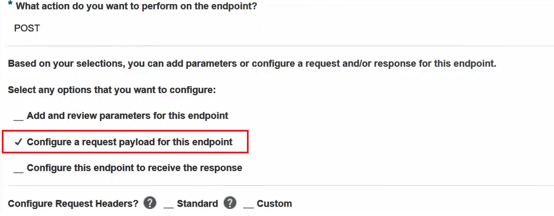
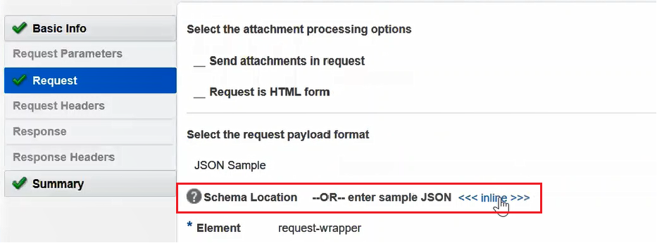

# OCI-OIC-HCM Object Upload Function
## About
This function shows simplified uploading of a CSV file into Oracle Object Storage using data received from Oracle Integration Cloud (OIC) through REST to invoke this function. The function expects a POST operation with a payload to put into a CSV file.


## Setup Instructions
As you make your way through this tutorial, look out for this icon .
Whenever you see it, it's time for you to perform an action.


## Prerequisites
Before you deploy this sample function, make sure you have run step A, B and C of the [Oracle Functions Quick Start Guide for Cloud Shell](https://www.oracle.com/webfolder/technetwork/tutorials/infographics/oci_functions_cloudshell_quickview/functions_quickview_top/functions_quickview/index.html)
* A - Set up your tenancy
* B - Create application
* C - Set up your Cloud Shell dev environment


## List Applications 
Assuming your have successfully completed the prerequisites, you should see your 
application in the list of applications.
```
fn ls apps
```


## Create or Update your Dynamic Group
In order to use other OCI Services, your function must be part of a dynamic group. For information on how to create a dynamic group, refer to the [documentation](https://docs.cloud.oracle.com/iaas/Content/Identity/Tasks/managingdynamicgroups.htm#To).

When specifying the *Matching Rules*, we suggest matching all functions in a compartment with:
```
ALL {resource.type = 'fnfunc', resource.compartment.id = 'ocid1.compartment.oc1..aaaaaxxxxx'}
```
Please check the [Accessing Other Oracle Cloud Infrastructure Resources from Running Functions](https://docs.cloud.oracle.com/en-us/iaas/Content/Functions/Tasks/functionsaccessingociresources.htm) for other *Matching Rules* options.


## Create or Update IAM Policies for Dynamic Groups
Create a new policy that allows the dynamic group to manage the Object Storage resource. We will grant `manage` access to allow our function to put objects into the Object Storage in the compartment.


Your policy should look something like this:
```
Allow dynamic-group <dynamic-group-name> to manage object-family in compartment id <compartment-id>
```
e.g.
```
Allow dynamic-group oci-oic-fn-dynamic-group to manage object-family in compartment id ocid1.compartment.oc1..aaaaaaaa4233
```

For more information on how to create policies, check the [documentation](https://docs.cloud.oracle.com/iaas/Content/Identity/Concepts/policysyntax.htm).

## Review and customize the function
Review the following files in the current folder:
* the code of the function, [func.py](./processEmployee/func.py)
* its dependencies, [requirements.txt](./processEmployee/requirements.txt)
* the function metadata, [func.yaml](./processEmployee/func.yaml)


## Deploy the function
In Cloud Shell, run the *fn deploy* command to build the function and its dependencies as a Docker image, 
push the image to OCIR, and deploy the function to Oracle Functions in your application.


```
fn -v deploy --app <app-name>
```

## Set the function configuration values
The function requires the following configuration values to be set:
- OCI_NAMESPACE
- OCI_BUCKETNAME


Use the *fn CLI* to set the config value:
```
fn config function <app-name> <function-name> OCI_NAMESPACE <NAMESPACE>
fn config function <app-name> <function-name> OCI_BUCKETNAME <BUCKETNAME>
```
e.g.
```
fn config function myapp OCI_NAMESPACE mynamespace
fn config function myapp OCI_BUCKETNAME mybucket
```

## Test the function
After deploying the function and configuring the namespace and the bucketname, you can test the function by invoking the function with a JSON payload as shown below.


```bash
echo -n "{
    'firstname': '',
    'lastname': '',
    'workemail': '',
    'hiredate': '',
    'effectivestartdate': '',
    'personid': ''
}" | fn invoke <app-name> <function-name>
```

## Calling the function from OIC
To call the function from OIC, you will have to have an integration using a REST adapter connection pointing to this function.


To setup your REST connection in your integration, the option `Configure a request payload for this endpoint` in the Basic Info page must be *checked*. 



On the next tab, `Requests`, the below sample json needs to be set for the target data to appear inside the mapper. Enter a sample JSON like the one below to describe the HTTP message payload. You can set this definition by click on `inline` as shown below.



```bash
{
    'firstname': '',
    'lastname': '',
    'workemail': '',
    'hiredate': '',
    'effectivestartdate': '',
    'personid': ''
}
```

In the mapper connecting to the REST adapter connection, the data in the source needs to be mapped to the target. In this case, the source data is from a GET request pulling the information from Oracle Human Capital Management (HCM).


An example of how this invocation is done from OIC can be found in this [documentation](https://docs.oracle.com/en/cloud/paas/integration-cloud/rest-adapter/configure-rest-adapter-consume-oracle-functions.html).
