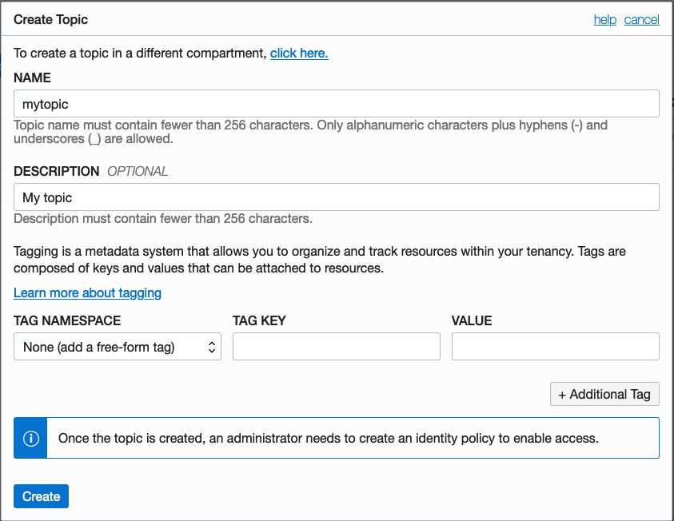
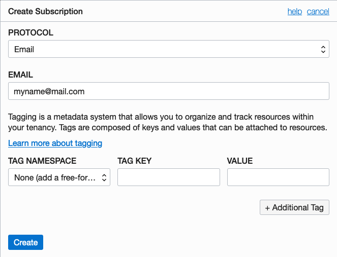

# Function that publishes a notification
This function publishes a notification.

As you make your way through this tutorial, look out for this icon .
Whenever you see it, it's time for you to perform an action.


## Prerequisites
Before you deploy this sample function, make sure you have run step A, B and C of the [Oracle Functions Quick Start Guide for Cloud Shell](https://www.oracle.com/webfolder/technetwork/tutorials/infographics/oci_functions_cloudshell_quickview/functions_quickview_top/functions_quickview/index.html)
* A - Set up your tenancy
* B - Create application
* C - Set up your Cloud Shell dev environment


## List Applications 
Assuming your have successfully completed the prerequisites, you should see your 
application in the list of applications.
```
fn ls apps
```


## Create or Update your Dynamic Group
In order to use other OCI Services, your function must be part of a dynamic group. For information on how to create a dynamic group, refer to the [documentation](https://docs.cloud.oracle.com/iaas/Content/Identity/Tasks/managingdynamicgroups.htm#To).

When specifying the *Matching Rules*, we suggest matching all functions in a compartment with:
```
ALL {resource.type = 'fnfunc', resource.compartment.id = 'ocid1.compartment.oc1..aaaaaxxxxx'}
```
Please check the [Accessing Other Oracle Cloud Infrastructure Resources from Running Functions](https://docs.cloud.oracle.com/en-us/iaas/Content/Functions/Tasks/functionsaccessingociresources.htm) for other *Matching Rules* options.


## Create or Update IAM Policies
Create a new policy that allows the dynamic group to use the Notificaton Service. We will grant `use` access to `ons-topics` in the compartment.


Your policy should look something like this:
```
Allow dynamic-group <dynamic-group-name> to use ons-topics in compartment <compartment-name>
```

For more information on how to create policies, check the [documentation](https://docs.cloud.oracle.com/iaas/Content/Identity/Concepts/policysyntax.htm).


## Review and customize the function
Review the following files in the current folder:
* the code of the function, [PublishONS.cs](./PublishONS.cs)
* its dependencies, [PublishONS.csproj](./PublishONS.csproj)
* the function metadata, [func.yaml](./func.yaml)


## Deploy the function
In Cloud Shell, run the *fn deploy* command to build the function and its dependencies as a Docker image, 
push the image to OCIR, and deploy the function to Oracle Functions in your application.


```
fn -v deploy --app <app-name>
```


## Create the Notification topic
Create a Notification topic with an email subscription.


Go to the OCI console, navigate to Application Integration > Notifications. Click *Create Topic*.



Click on your topic and create a email subscription to this topic by clicking *Create Subscription* and entering your email address. You will receive an email to confirm your subscription.



Note the OCID of your topic.


## Invoke the function
Run the following command to test your function.


```
echo '{"topic_id": "<Topic-OCID>", "msg_title": "message-title", "msg_body": "message-body"}' | fn invoke <app-name> oci-ons-publish-dotnet
```
e.g.:
```
echo '{"topic_id": "ocid1.onstopic.xxxx", "msg_title": "a message from Functions", "msg_body": "This email was sent by Oracle Functions!"}' | fn invoke myapp oci-ons-publish-dotnet
```

Upon success, you should receive an email from the Notification Service.


## Monitoring Functions and Notifications Topics

Learn how to configure basic observability for your function and topic using metrics, alarms and email alerts:
* [Basic Guidance for Monitoring your Functions](../basic-observability/functions.md)
* [Basic Guidance for Monitoring your Notifications Topics](../basic-observability/notifications.md)
