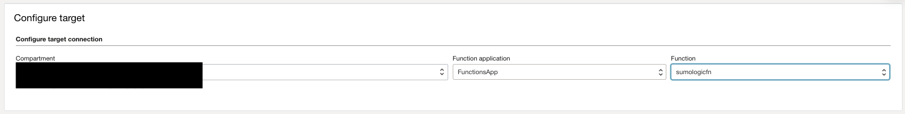

# Send OCI Events and Audit to SumoLogic via HTTPS

This is a sample to use a Service Connector Hub with Function as a target.  This function will take a single JSON or list of JSON objects, and write them to a configured SumoLogic endpoint.

This sample is based on the [documented SumoLogic Connector](https://help.sumologic.com/docs/send-data/collect-from-other-data-sources/collect-logs-oracle-cloud-infrastructure/) in OCI Docs, but with a couple of minor differences:
* It sends JSON documents instead of text
* Debugging is an option

As you make your way through this tutorial, look out for this icon .
Whenever you see it, it's time for you to perform an action.


## Prerequisites

Before you deploy this sample function, make sure you have run steps A, B 
and C of the [Oracle Functions Quick Start Guide for Cloud Shell](https://www.oracle.com/webfolder/technetwork/tutorials/infographics/oci_functions_cloudshell_quickview/functions_quickview_top/functions_quickview/index.html)
* A - Set up your tenancy
* B - Create application
* C - Set up your Cloud Shell dev environment


## List Applications 

Assuming you have successfully completed the prerequisites, you should see your 
application in the list of applications.

```
fn ls apps
```


## Review and customize the function

Review the following files in the current folder:
* the code of the function, [func.py](./func.py)
* its dependencies, [requirements.txt](./requirements.txt)
* the function metadata, [func.yaml](./func.yaml)


### Configure SumoLogic Endpoint

Within the `func.yaml` file, there is a configuration parameter called `SUMOLOGIC_ENDPOINT`.  This must be set either prior to deployment, or after deployment using the UI/CLI.

See [this link](https://help.sumologic.com/docs/send-data/hosted-collectors/http-source/logs-metrics/upload-logs/) how to generate this URL, and for additional headers and changes that could be made to this function.

The function here also allows a configuration called `DEBUG` - set this to true if additional output is desired.


## Deploy the function

In Cloud Shell, run the `fn deploy` command to build *this* function and its dependencies as a Docker image, 
push the image to the specified Docker registry, and deploy *this* function to Oracle Functions 
in the application created earlier:


```
fn -v deploy --app <app-name>
```
e.g.,
```
fn -v deploy --app myapp
```

### Test

In Cloud Shell, run the `fn invoke` ccommand to unit test this function:


```
fn invoke <app-name> <function-name> < test.json
```
e.g.,
```
fn invoke myapp oci-serviceconnector-sumologic-python < examples-json/audit.json
```

You should see no error or output returned by the function.  Function Logs will show a record of the call, and if `DEBUG` was enabled, then more will be shown.


## Create a Service Connector for OCI Audit Logging

1. From the navigation menu, select **Logging**, and then select **Service Connectors**.

2. Click Create Connector, add a Name, Description, select the compartment, select the Source as **Logging** and Target as **Functions** with no Task.
    
3. On Configure Source connection, select the compartment, select the _Audit log with sub-compartments enabled. (Doing so at the tenancy root will send ALL audit to SumoLogic)

4. On Configure Target connection, select the Functions compartment, the Functions App, and the `sumologicfn` Function. If prompted to create a policy, click Create.

### Screeen Shots

Service Connector Source


Service Connector Target


### OCI Events

This function can support OCI Events or multiple logs that are not audit.  The following screen shot shows a couple OCI Events for Cloud Guard going to the same function:


### Logging Filter

Service Connectors support Log filters as well.  In order to limit the logs sent to SumoLogic, the following example filter could be applied, which will only look for POST or PUT events, and prevent the listed message types from being sent at all. 

```
search "ocid1.compartment.oc1..xxxxx/_Audit_Include_Subcompartment" | (data.request.action='POST' or data.request.action='PUT') and (type!='io.k8s.coordination.v1.leases.update') and (type!='io.k8s.authentication.v1.tokenreviews.create') and (type!='com.oraclecloud.management-agent.ExchangeWorkSubmission')
```

## Monitoring Functions and Service Connector

Make sure you configure basic observability for your function and connector using metrics, alarms and email alerts:
* [Basic Guidance for Monitoring your Functions](../basic-observability/functions.md)
* [Basic Guidance for Monitoring your Service Connector](../basic-observability/service-connector-hub.md)
